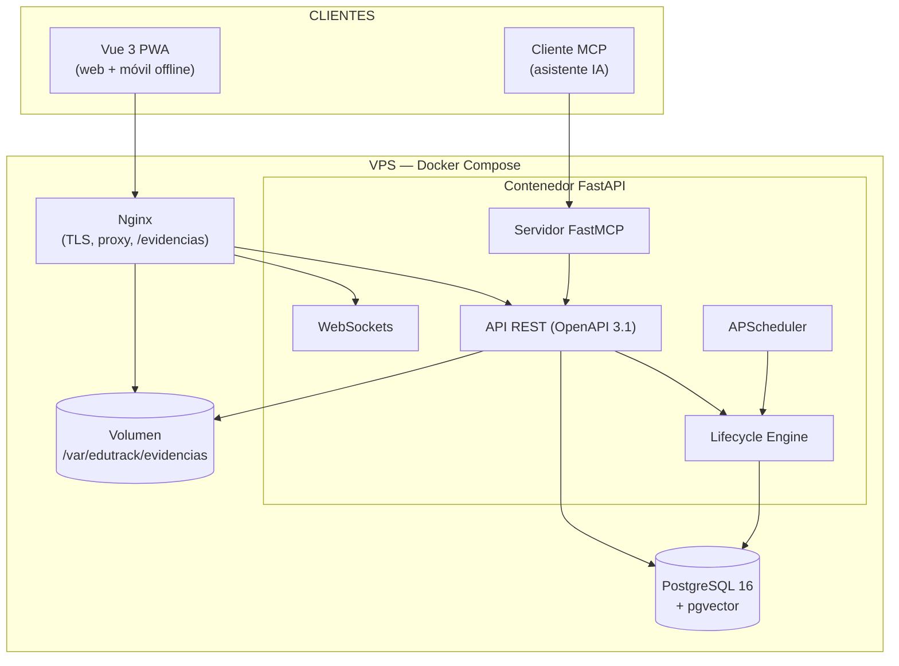
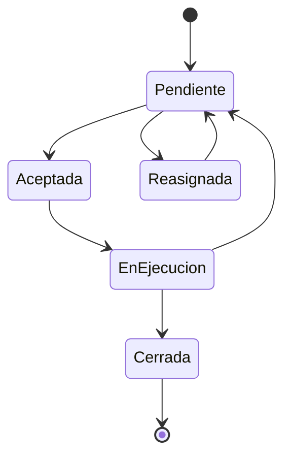

# 02 — Arquitectura técnica

> Este documento define CÓMO se construye EduTrack AI. Claude Code debe respetar esta arquitectura; cualquier desviación se registra primero en la sección "Decisiones de arquitectura" al final.

## 1. Vista general



## 2. Estructura de carpetas del backend

```
backend/
├── app/
│   ├── main.py                  # create_app(), routers, lifespan (arranca APScheduler)
│   ├── core/
│   │   ├── config.py            # Settings con pydantic-settings (lee .env)
│   │   ├── security.py          # hash bcrypt, creación/validación JWT
│   │   ├── database.py          # engine async, async_session_maker, get_db
│   │   └── deps.py              # get_current_user, require_role, get_tenant_id
│   ├── models/                  # SQLAlchemy 2.0 declarativo — 1 archivo por entidad
│   │   ├── base.py              # Base, mixin TimestampMixin, mixin TenantMixin
│   │   ├── institucion.py
│   │   ├── usuario.py
│   │   ├── catalogo.py          # CatalogoModelo, ReglaMantenimiento
│   │   ├── activo.py
│   │   ├── plan_mantenimiento.py
│   │   ├── reporte_falla.py
│   │   ├── orden_trabajo.py     # incluye Evidencia
│   │   ├── score_salud.py
│   │   └── alerta.py
│   ├── schemas/                 # Pydantic: XxxCreate, XxxUpdate, XxxOut
│   ├── api/
│   │   ├── v1/
│   │   │   ├── router.py        # incluye todos los sub-routers bajo /api/v1
│   │   │   ├── auth.py          # /auth/login, /auth/refresh
│   │   │   ├── activos.py
│   │   │   ├── catalogo.py
│   │   │   ├── reportes.py      # incluye endpoint público por QR
│   │   │   ├── ordenes.py
│   │   │   ├── evidencias.py    # upload multipart → filesystem
│   │   │   ├── dashboard.py
│   │   │   ├── proyeccion.py
│   │   │   └── admin.py         # solo super_admin
│   │   └── websockets.py        # /ws/notificaciones (por tenant)
│   ├── services/
│   │   ├── lifecycle_engine.py  # genera plan desde reglas del catálogo
│   │   ├── score_service.py     # cálculo del score 0-100 (4 factores)
│   │   ├── proyeccion_service.py
│   │   ├── qr_service.py        # genera PNG del QR (librería qrcode)
│   │   ├── evidencia_service.py # guardado seguro en filesystem
│   │   └── rag_service.py       # indexación de manuales PDF en pgvector
│   ├── mcp/
│   │   ├── server.py            # instancia FastMCP, montaje y auth
│   │   └── tools.py             # las 4 herramientas de solo lectura
│   └── jobs/
│       └── nightly.py           # job 02:00: alertas + recálculo de scores
├── alembic/
├── tests/
│   ├── conftest.py              # fixtures: BD de test, cliente, 2 tenants, tokens por rol
│   └── ...                      # espeja app/ (test_activos.py, test_ordenes.py, ...)
├── pyproject.toml               # deps + config de ruff y pytest
└── Dockerfile
```

## 3. Estructura del frontend

```
frontend/
├── src/
│   ├── main.js                  # Vue 3 + router + Pinia + registro del SW
│   ├── router/                  # guardas por rol
│   ├── stores/                  # Pinia: auth, activos, ordenes, notificaciones
│   ├── composables/
│   │   ├── useApi.js            # fetch con JWT + refresh automático
│   │   ├── useWebSocket.js      # conexión /ws con reconexión
│   │   └── useOffline.js        # cola IndexedDB + sincronización
│   ├── views/                   # por rol: coordinador/, director/, tecnico/, docente/, admin/
│   └── components/
├── public/                      # manifest.json, service worker
└── vite.config.js
```

## 4. Modelo de datos

Tablas con su propósito (el DDL exacto lo definen los modelos SQLAlchemy + migraciones Alembic). Todas las tablas operativas heredan `TenantMixin` (`institucion_id` FK, indexado) salvo `institucion` y `catalogo_*` que son globales.

| Tabla | Propósito | Campos clave |
| --- | --- | --- |
| `institucion` | Tenant del SaaS | `id (uuid)`, `nombre`, `ruc`, `activa` |
| `usuario` | Usuarios con rol | `email único`, `password_hash`, `rol enum`, `institucion_id` |
| `catalogo_modelo` | Modelos de fabricantes (global) | `marca`, `modelo`, `categoria`, `vida_util_meses`, `especificaciones jsonb` |
| `regla_mantenimiento` | Reglas por modelo (global) | `modelo_id`, `tipo_tarea`, `intervalo_dias` |
| `activo` | Equipo registrado | `modelo_id`, `codigo_qr único`, `ubicacion`, `fecha_instalacion`, `estado` |
| `plan_mantenimiento` | Tareas programadas por activo | `activo_id`, `tipo_tarea`, `fecha_programada`, `estado` |
| `reporte_falla` | Reporte del docente | `activo_id`, `docente_id`, `descripcion`, `foto_path` |
| `orden_trabajo` | OT con ciclo de estados | `activo_id`, `tecnico_id`, `tipo`, `prioridad`, `estado`, `fecha_limite`, `cerrada_en` |
| `evidencia` | Fotos de la intervención | `orden_id`, `archivo_path` |
| `score_salud` | Histórico del score | `activo_id`, `score int`, `factores jsonb`, `calculado_en` |
| `alerta` | Alertas del scheduler | `activo_id`, `tipo`, `mensaje`, `atendida` |
| `mcp_audit_log` | Auditoría de herramientas MCP | `usuario_id`, `herramienta`, `parametros jsonb`, `invocada_en` |
| `documento_rag` | Chunks de manuales indexados | `modelo_id`, `contenido`, `embedding vector` |

### Estados de la orden de trabajo



Implementar las transiciones como método del modelo o servicio que valide el estado origen; transición inválida → HTTP 409.

## 5. Cálculo del score de salud (PMV)

Score = promedio ponderado de 4 factores normalizados a 0–100:

| Factor | Peso | Cálculo |
| --- | --- | --- |
| Vida útil restante | 35% | `max(0, 1 - meses_uso / vida_util_meses) * 100` |
| Cumplimiento de mantenimientos | 30% | `mantenimientos_ejecutados_a_tiempo / programados_vencidos * 100` (100 si no hay vencidos) |
| Frecuencia de fallas | 20% | `max(0, 100 - 25 * fallas_ultimos_90_dias)` |
| Recencia de intervención | 15% | 100 si ≤ 30 días; decae linealmente a 0 en 365 días |

Score < 40 ⇒ crear `alerta` tipo `riesgo_falla` (idempotente: no duplicar si ya existe una no atendida). Los pesos viven en `config.py` como constantes, no hardcodeados en el servicio.

## 6. Autenticación y autorización

- `POST /api/v1/auth/login` → `access_token` (30 min) + `refresh_token` (7 días), ambos JWT HS256.
- Claims del token: `sub` (usuario_id), `rol`, `institucion_id`, `exp`.
- Dependencias FastAPI: `get_current_user` (valida JWT), `require_role("coordinador", ...)`, `get_tenant_id`.
- El reporte del docente por QR usa un endpoint público con el token del QR del activo + identificación liviana del docente (nombre + email institucional); no requiere cuenta con contraseña.
- Reglas de Nginx: `/evidencias/` solo accesible con cabecera validada por `auth_request` hacia la API (no exponer el directorio abierto).

## 7. Tiempo real (WebSockets)

- Un endpoint `/ws/notificaciones?token=JWT`. Al conectar, se valida el JWT y se registra la conexión en un `ConnectionManager` agrupado por `institucion_id`.
- Eventos emitidos: `nuevo_reporte`, `ot_asignada`, `ot_cerrada`, `alerta_creada`, `score_actualizado`.
- El dashboard se suscribe y actualiza Pinia; nunca recarga la página.

## 8. Jobs programados (APScheduler)

- `AsyncIOScheduler` arrancado en el `lifespan` de FastAPI.
- Job `nightly_maintenance` a las 02:00 América/Lima: (1) genera alertas a 15 y 5 días, (2) marca vencidos, (3) recalcula scores de todos los activos, (4) emite eventos WebSocket.
- Los jobs deben ser idempotentes: correrlos dos veces no duplica alertas.

## 9. Servidor MCP (FastMCP)

- Se monta en la misma aplicación (transporte HTTP) bajo `/mcp`.
- Autenticación: el cliente MCP presenta un token de API generado por el coordinador/director desde su perfil (scope de solo lectura, asociado a su `institucion_id`).
- Herramientas (todas filtran por el tenant del token y registran en `mcp_audit_log`):
  1. `consultar_score_activos(categoria?, umbral?)`
  2. `listar_ots_pendientes(prioridad?)`
  3. `consultar_historial_activo(codigo_qr | activo_id)`
  4. `obtener_proyeccion_presupuesto(anio)`
- Prohibido: cualquier herramienta de escritura (regla del PMV).

## 10. Despliegue (Docker Compose)

Servicios: `api` (FastAPI/Uvicorn), `db` (postgres:16 + pgvector, volumen persistente), `frontend` (build estático servido por Nginx), `nginx` (proxy TLS Let's Encrypt). Respaldo diario: `pg_dump` + rsync de `/var/edutrack/evidencias` a almacenamiento externo (cron del host).

## 11. Decisiones de arquitectura (ADR-lite)

Registrar aquí toda decisión nueva con fecha y motivo. Formato: `AAAA-MM-DD — Decisión — Motivo — Alternativas descartadas`.

- 2026-06 — SQLAlchemy async + sesiones por request — coherente con FastAPI async; la transacción se confirma en la dependencia, no en servicios — Sync descartado por bloqueo del event loop.
- 2026-06 — Evidencias en filesystem (no en BD ni S3) — restricción 5 del proyecto; migración futura a S3 vía interfaz `EvidenciaStorage` — S3 pospuesto a V2.
- 2026-06 — MCP solo lectura — control de riesgo del PMV; escritura requiere confirmaciones y auditoría adicionales — pospuesto a V2.
