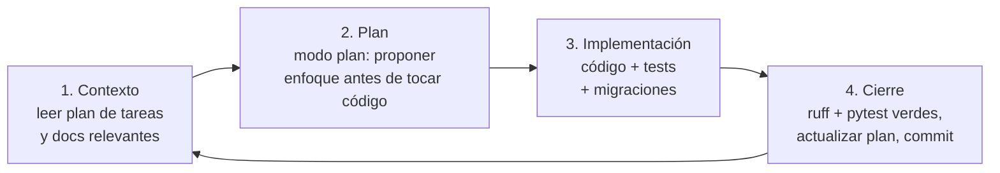

# 05 — Flujo de trabajo con Claude Code

> Guía para el equipo humano: cómo conducir el desarrollo de EduTrack AI con Claude Code como agente principal. Para detalles oficiales de Claude Code ver https://docs.claude.com/en/docs/claude-code/overview

## 1. Preparación inicial (una sola vez)

1. Instalar Claude Code (paquete npm `@anthropic-ai/claude-code`) y autenticarse.
2. Clonar el repositorio y verificar que `CLAUDE.md` está en la raíz: Claude Code lo carga automáticamente al iniciar cada sesión.
3. Levantar el entorno con `docker compose up -d` para que Claude pueda ejecutar tests reales contra PostgreSQL.
4. Los comandos personalizados del proyecto viven en `.claude/commands/` y se invocan con `/nombre-del-comando` (están versionados en el repo, todo el equipo los comparte).

## 2. Ciclo de trabajo por sesión

Cada sesión de Claude Code sigue el mismo ciclo de cuatro etapas. No saltarse la etapa de plan en tareas no triviales.

**Etapa 1 — Contexto.** Iniciar la sesión pidiendo a Claude que lea `docs/03-PLAN-DE-TAREAS.md` e identifique la siguiente tarea pendiente de la fase activa (o usar el comando `/siguiente-tarea`).

**Etapa 2 — Plan.** Para tareas medianas o grandes, usar el modo plan de Claude Code para que proponga el enfoque (archivos a tocar, modelos, endpoints, tests) ANTES de escribir código. Revisar y aprobar el plan. Esto evita re-trabajo.

**Etapa 3 — Implementación.** Claude implementa siguiendo `CLAUDE.md` y los estándares. Pedirle que escriba los tests junto con el código (o antes, estilo TDD para los servicios del motor de ciclo de vida y del score, donde los criterios del PRD son verificables).

**Etapa 4 — Cierre.** Claude debe: correr `ruff check` y `pytest` hasta verde, marcar la tarea en el plan, agregar la fila al registro de avance y hacer el commit con Conventional Commits. El comando `/cerrar-tarea` automatiza esta etapa.

## 3. Reglas de oro para el equipo

- **Una tarea por conversación.** Al terminar una tarea, limpiar el contexto (`/clear`) antes de empezar la siguiente; el estado persistente vive en los archivos del repo, no en la conversación. Si la conversación se alarga dentro de una misma tarea, compactar (`/compact`).
- **El plan de tareas es la fuente de verdad.** Si Claude propone trabajo fuera del backlog, primero se agrega como tarea (sección correspondiente) y luego se implementa. Nada del backlog V2 sin autorización explícita.
- **Revisar los diffs siempre.** Claude Code muestra los cambios antes de aplicarlos; el humano es el revisor. Prestar atención especial al checklist de seguridad de `docs/04-ESTANDARES-DE-CODIGO.md`.
- **Tests como contrato.** Los criterios de aceptación del PRD se traducen a tests; una HU no está terminada si sus criterios no tienen test que los verifique.
- **Commits pequeños y frecuentes**, uno por tarea o sub-tarea coherente. Ante un experimento riesgoso, crear una rama antes.
- **Mantener `CLAUDE.md` vivo.** Cuando se corrija dos veces el mismo error de Claude (una convención que no respeta, un patrón que olvida), agregar la regla a `CLAUDE.md` o a los estándares para que no se repita (editable con `/memory`).
- **Decisiones de arquitectura** nuevas se registran en `docs/02-ARQUITECTURA.md` §11 antes de implementarlas.

## 4. Comandos personalizados del proyecto

| Comando | Qué hace |
| --- | --- |
| `/siguiente-tarea` | Lee el plan, identifica la siguiente tarea pendiente, propone un plan de implementación y espera aprobación |
| `/cerrar-tarea` | Verifica DoD (ruff + pytest + migraciones), actualiza el plan de tareas y el registro de avance, y prepara el commit |
| `/revisar` | Revisión de los cambios recientes contra los estándares y el checklist de seguridad (tenant, uploads, secretos) |

Fuente de cada comando: `.claude/commands/*.md`. Agregar nuevos comandos cuando un flujo se repita ≥ 3 veces.

## 5. Distribución del trabajo humano + agente

| Actividad | Humano | Claude Code |
| --- | --- | --- |
| Priorizar backlog y aceptar criterios | ✅ decide | propone |
| Plan de implementación de la tarea | revisa/aprueba | ✅ elabora |
| Escribir código y tests | revisa diffs | ✅ implementa |
| Migraciones y seeds | aprueba | ✅ genera |
| Revisión de seguridad | ✅ responsable final | ejecuta checklist |
| Demo de sprint y validación con piloto | ✅ | prepara datos/escenarios |
| Despliegue a producción | ✅ ejecuta y supervisa | prepara scripts y verifica |

## 6. Sesiones tipo por sprint

- **Inicio de sprint:** sesión de planificación — Claude lee el PRD y el plan, confirma el alcance del sprint y detecta dependencias o tareas faltantes.
- **Desarrollo:** sesiones de 1 tarea (ciclo §2). Tareas independientes pueden trabajarse en paralelo con worktrees de git si hay más de un humano supervisando.
- **Cierre de sprint:** sesión de integración — correr la suite completa, revisar cobertura de los criterios de aceptación de las HU del sprint, actualizar documentación y preparar la demo del hito (H2/H3/H4).
