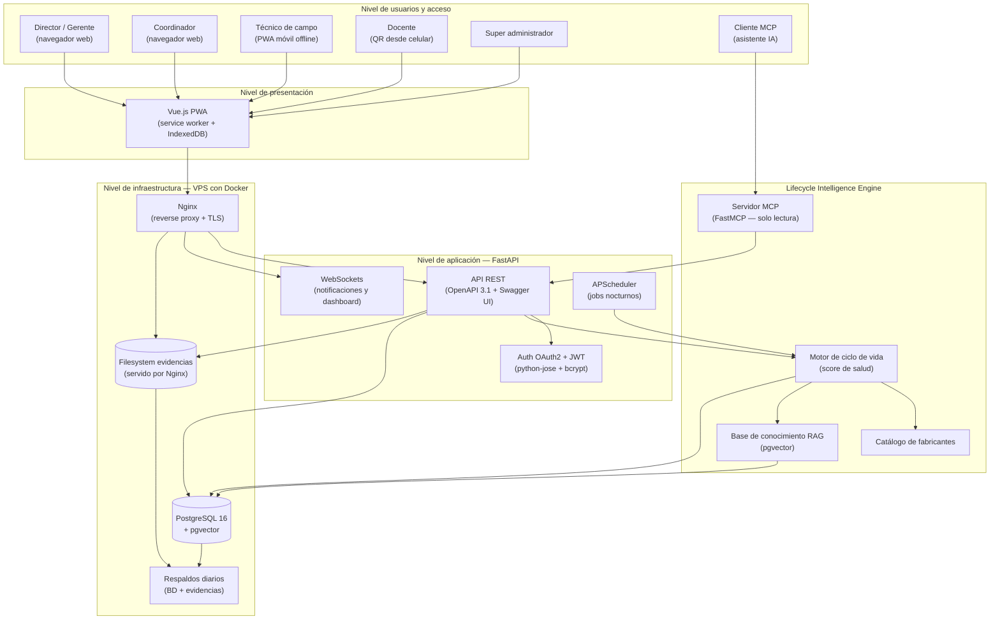
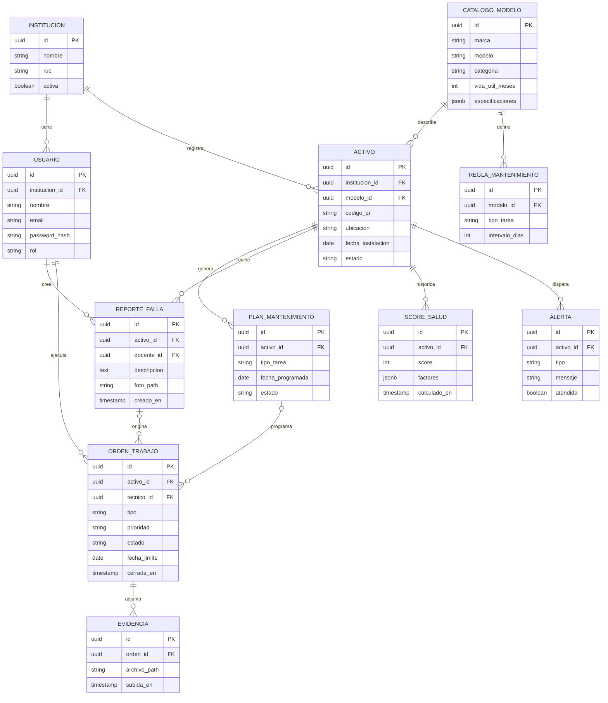
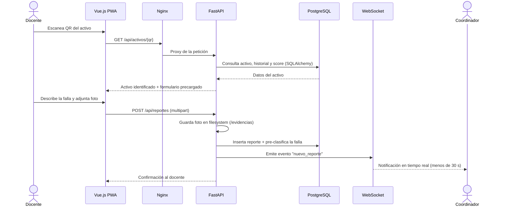
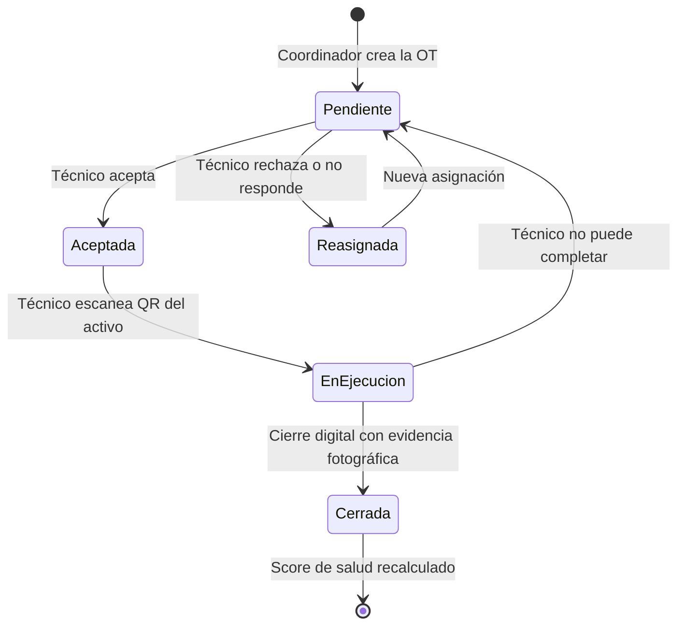
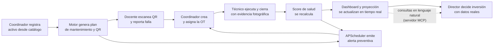
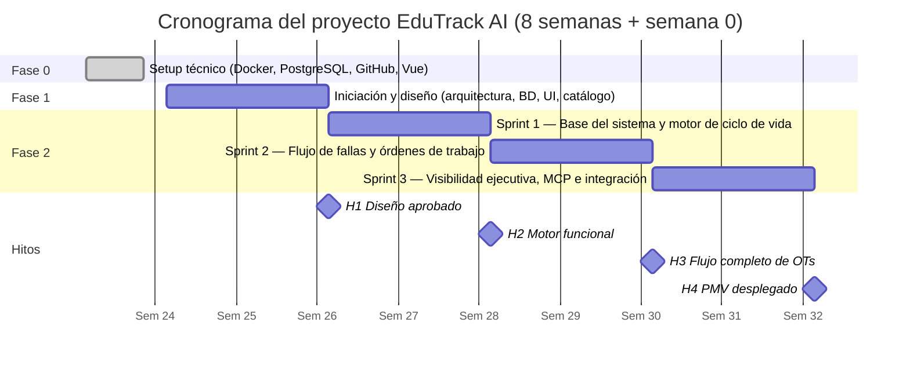

# EduTrack AI

> Plataforma SaaS de gestión inteligente del ciclo de vida de activos tecnológicos para instituciones educativas privadas del Perú.

**Stack tecnológico:** Python 3.12 · FastAPI · PostgreSQL 16 · SQLAlchemy 2.0 · Alembic · OpenAPI · MCP (FastMCP) · Vue.js (PWA) · Docker · Nginx

---

## Tabla de contenido

- [Introducción](#introducción)
- [1. Concepción de la idea y alcance](#1-concepción-de-la-idea-y-alcance)
- [2. Objetivos del proyecto](#2-objetivos-del-proyecto)
- [3. Evaluación del impacto e importancia](#3-evaluación-del-impacto-e-importancia)
- [4. Antecedentes del problema](#4-antecedentes-del-problema)
- [5. Estado del arte](#5-estado-del-arte)
- [6. Análisis del entorno](#6-análisis-del-entorno)
- [7. Grado de innovación y ventaja comparativa](#7-grado-de-innovación-y-ventaja-comparativa)
- [8. Obtención y especificación de requisitos de software](#8-obtención-y-especificación-de-requisitos-de-software)
- [9. Arquitectura de la solución](#9-arquitectura-de-la-solución)
- [10. Producto mínimo viable](#10-producto-mínimo-viable)
- [11. Planificación inicial](#11-planificación-inicial)
- [12. Listado de recursos](#12-listado-de-recursos)
- [Conclusiones](#conclusiones)
- [Referencias bibliográficas](#referencias-bibliográficas)

---

## Introducción

La gestión de activos tecnológicos en instituciones educativas privadas del Perú enfrenta un problema estructural que afecta directamente la continuidad del proceso académico. Según datos del Ministerio de Educación, Lima Metropolitana concentra más de 5,600 colegios privados, ninguno de los cuales cuenta con un sistema especializado para gestionar el ciclo de vida de sus equipos tecnológicos y de infraestructura. La ausencia de herramientas adecuadas obliga a estas instituciones a operar de forma reactiva, atendiendo las fallas una vez que ya ocurrieron, sin historial de intervenciones, sin trazabilidad y sin capacidad de planificar el presupuesto de mantenimiento con anticipación.

Frente a este problema, el presente documento propone EduTrack AI, una plataforma SaaS web y móvil que permite a las instituciones educativas registrar sus activos tecnológicos y de infraestructura, y obtener de forma automática un plan de mantenimiento basado en los manuales reales de los fabricantes. Un motor de inteligencia artificial denominado Lifecycle Intelligence Engine monitorea el ciclo de vida de cada equipo, calcula su estado de salud en tiempo real, anticipa fallas antes de que ocurran y proyecta el presupuesto de mantenimiento por periodo académico. La plataforma está diseñada específicamente para el contexto educativo peruano, con un modelo de precios accesible y un catálogo de activos preconfigurado que elimina la barrera de adopción que presentan los sistemas genéricos disponibles en el mercado internacional.

Este documento desarrolla la concepción completa del proyecto. Se presenta la idea y su alcance, los objetivos que persigue, la evaluación del impacto e importancia de la solución, los antecedentes del problema con fuentes objetivas que acreditan su existencia, el estado del arte, el análisis del entorno, el grado de innovación, los requisitos de software expresados como historias de usuario en el marco de Scrum, la arquitectura de la solución, el producto mínimo viable que guiará la primera entrega, la planificación inicial y el listado de recursos necesarios para su construcción.

## 1. Concepción de la idea y alcance

### 1.1 Descripción general de la solución

EduTrack AI es una plataforma SaaS (Software as a Service) de gestión inteligente de activos educativos orientada a colegios e institutos privados en el Perú. La plataforma combina un catálogo de activos preconfigurado con información técnica real de fabricantes con un Lifecycle Intelligence Engine, un motor de inteligencia artificial que calcula el plan de mantenimiento de cada equipo registrado, monitorea su ciclo de vida, anticipa fallas y proyecta el presupuesto de mantenimiento por periodo académico.

El sistema opera en dos interfaces complementarias: un panel web para directores, coordinadores de infraestructura y técnicos, y una interfaz móvil optimizada para el reporte rápido de fallas por parte de docentes mediante escaneo de código QR desde el navegador del celular, sin necesidad de instalar ninguna aplicación adicional.

### 1.2 Problema que resuelve

EduTrack AI resuelve la ausencia de visibilidad real sobre el estado de los activos tecnológicos y de infraestructura en instituciones educativas privadas. Sin un sistema estructurado, las fallas se atienden de forma reactiva, los presupuestos de mantenimiento se definen sin datos confiables y los equipos se reemplazan cuando ya dejaron de funcionar, no cuando el análisis de su ciclo de vida indica que es el momento óptimo para hacerlo.

### 1.3 Alcance del sistema

La versión inicial del sistema, correspondiente al Producto Mínimo Viable, contempla las siguientes funcionalidades:

- Registro de activos educativos con generación automática del plan de mantenimiento basado en especificaciones del fabricante.
- Reporte de fallas por parte del docente mediante escaneo de código QR desde el celular.
- Generación y asignación de órdenes de trabajo hacia técnicos internos o proveedores externos.
- Captura de evidencia fotográfica y cierre digital de intervenciones por el técnico de campo.
- Dashboard de estado de salud de activos con indicadores por equipo, aula y categoría.
- Proyección de presupuesto de mantenimiento y reemplazo para el año escolar.
- Historial completo de intervenciones por activo.
- Servidor MCP (Model Context Protocol) que expone las herramientas de consulta del sistema al asistente de inteligencia artificial.

Quedan fuera del alcance del PMV la integración con sistemas de matrícula como SIAGIE, la gestión financiera del colegio, el módulo de múltiples sedes y la incorporación de activos fuera del rango tecnológico y HVAC básico. Estas funcionalidades forman parte de la hoja de ruta de escalabilidad del producto en versiones posteriores.

### 1.4 Público objetivo

EduTrack AI está dirigido a colegios e institutos privados de tamaño mediano en el Perú, especialmente aquellos con entre 200 y 800 alumnos que cuentan con laboratorios de cómputo, equipamiento audiovisual en aulas y sistemas básicos de climatización, pero no disponen de un sistema formal de gestión de activos. Dentro de estas instituciones, los usuarios directos son los coordinadores de infraestructura o área técnica, los técnicos de mantenimiento, los docentes que reportan fallas y los directores o gerentes que necesitan visibilidad del estado operativo de la institución.

## 2. Objetivos del proyecto

### 2.1 Objetivo general

Desarrollar una plataforma SaaS web y móvil que permita a las instituciones educativas privadas del Perú gestionar de forma inteligente el ciclo de vida de sus activos tecnológicos y de infraestructura, reduciendo el tiempo de inactividad por fallas no anticipadas y mejorando la toma de decisiones sobre mantenimiento y reemplazo de equipos mediante el uso de inteligencia artificial.

### 2.2 Objetivos específicos

- Implementar un motor de ciclo de vida de activos que genere automáticamente el plan de mantenimiento preventivo de cada equipo registrado, basado en las especificaciones técnicas reales de los fabricantes, eliminando la necesidad de configuración manual por parte del usuario.
- Desarrollar un mecanismo de reporte de fallas mediante código QR que permita al docente registrar un problema desde su celular en menos de un minuto, sin instalar ninguna aplicación, formalizando el proceso de reporte y eliminando el uso de canales informales como WhatsApp.
- Construir un dashboard ejecutivo con indicadores de estado de salud por activo y una proyección de presupuesto de mantenimiento y reemplazo por periodo académico, que proporcione al director información confiable para la toma de decisiones de inversión.

## 3. Evaluación del impacto e importancia

### 3.1 Impacto social

La calidad del aprendizaje en un aula está directamente relacionada con el estado de los equipos que se usan en ella. Un proyector sin imagen, una pizarra interactiva descalibrada o una PC de laboratorio que no enciende no son solo inconvenientes técnicos, son interrupciones del proceso educativo que afectan a decenas de estudiantes cada vez que ocurren. EduTrack AI reduce esas interrupciones al anticipar las fallas antes de que ocurran, garantizando que los equipos estén disponibles cuando el proceso académico los necesita. Además, al eliminar el uso de WhatsApp como canal de gestión, formaliza la comunicación entre docentes y técnicos, reduce el ruido informativo y da al equipo técnico la priorización que necesita para operar con eficiencia.

### 3.2 Impacto económico

El mantenimiento correctivo reactivo, es decir, atender los equipos cuando ya fallaron, es consistentemente más costoso que el preventivo. Un proyector que recibe limpieza de filtros cada tres meses dura significativamente más que uno que se atiende solo cuando se apaga por sobrecalentamiento. EduTrack AI desplaza la gestión desde el modo reactivo hacia el preventivo y predictivo, extendiendo la vida útil de los activos y reduciendo el costo total de propiedad de los equipos. Adicionalmente, la proyección de presupuesto que ofrece el sistema permite a los directores planificar con anticipación la inversión en mantenimiento y reemplazo, eliminando los gastos de emergencia no presupuestados que hoy afectan a muchas instituciones al inicio del año escolar.

### 3.3 Impacto tecnológico

EduTrack AI introduce en el mercado educativo peruano un modelo de gestión de activos que no existe actualmente para este sector. La combinación de un catálogo preconfigurado con datos técnicos reales de fabricantes, un motor de ciclo de vida por activo y un asistente con inteligencia artificial conectado mediante el protocolo MCP representa un nivel de sofisticación que las instituciones educativas peruanas no han tenido acceso hasta ahora, y que los sistemas genéricos internacionales no ofrecen adaptado a este contexto ni a este precio.

### 3.4 Beneficiarios directos e indirectos

Los beneficiarios directos son los coordinadores de infraestructura y técnicos de mantenimiento, quienes pasan de operar en modo reactivo a tener un plan estructurado y automatizado. Los directores y gerentes se benefician de visibilidad real para tomar decisiones de inversión con respaldo en datos. Los beneficiarios indirectos son los docentes, que dejan de gestionar reportes por canales informales, y los estudiantes, que reciben clases en aulas con equipos en mejor estado y con menor tiempo de inactividad por fallas no anticipadas.

## 4. Antecedentes del problema

### 4.1 Descripción del problema

En el Perú, muchos colegios e institutos privados no cuentan con un sistema estructurado para gestionar el mantenimiento de sus activos tecnológicos y de infraestructura. El reporte de fallas llega por mensajes de WhatsApp o llamadas telefónicas, el técnico atiende según la urgencia percibida y no según la prioridad real, y no existe ningún registro que relacione cada intervención con el activo específico que fue atendido.

Esta situación genera tres consecuencias directas y verificables. Primero, los equipos fallan en momentos críticos del calendario escolar porque nadie los revisó preventivamente cuando había tiempo para hacerlo. Segunda, el director o gerente no puede tomar decisiones informadas sobre qué equipos renovar ni cuánto presupuestar para mantenimiento, porque no tiene datos históricos confiables sobre los que basar esa decisión. Tercera, cuando un técnico nuevo llega a la institución, empieza completamente desde cero porque el conocimiento sobre el estado de los equipos estaba en la cabeza del técnico anterior o en mensajes de WhatsApp que nadie puede recuperar de forma ordenada.

El problema no es exclusivo de las instituciones con menos recursos. Colegios privados medianos con pensiones de cuatro a seis cifras en soles pueden tener laboratorios bien equipados y sin embargo gestionar el mantenimiento de esos equipos con el mismo nivel de informalidad que una institución sin presupuesto, simplemente porque no existe una herramienta accesible y específica para su contexto.

### 4.2 Fuente objetiva 1 - Crisis de infraestructura educativa documentada

Según el Censo Escolar 2024, el 21% de equipos en instituciones educativas públicas están inoperativos. En comparación, en colegios privados, dicho porcentaje es de solo 2%. Asimismo, el 21.5% de los hogares con niños en colegios estatales considera que el equipamiento es malo o muy malo, más de tres veces el descontento en familias con hijos en escuelas privadas. Este deterioro sistemático no refleja ausencia de inversión sino ausencia de mantenimiento preventivo estructurado. Que los colegios privados tengan solo un 2% de equipos inoperativos no significa que gestionen mejor sus activos, sino que tienen mayor capacidad de reemplazo inmediato cuando los equipos ya fallaron. El problema de fondo en ambos sectores es idéntico: ninguno cuenta con un sistema que anticipe las fallas antes de que ocurran y planifique el mantenimiento preventivo de forma sistemática [1].

### 4.3 Fuente objetiva 2 - Dimensión del mercado sin cobertura sistematizada

Según un análisis de Equifax con datos del Ministerio de Educación publicado por RPP en febrero de 2024, el 74% de los 7,602 colegios en Lima Metropolitana son privados, lo que representa más de 5,600 instituciones con casi 1.9 millones de alumnos matriculados. Ninguna de estas instituciones tiene acceso a un sistema de gestión de activos diseñado específicamente para el sector educativo peruano. El único sistema digital diseñado para gestionar y monitorear el mantenimiento de los locales escolares a nivel nacional es el programa Wasichay del MINEDU, cuya cobertura está limitada exclusivamente a instituciones públicas y cuyo alcance se restringe a la gestión de transferencias presupuestales, no a la gestión operativa de activos individuales [2].

### 4.4 Fuente objetiva 3 - Inversión en tecnología educativa sin gestión del ciclo de vida

Durante los años 2020 a 2022, las instituciones educativas privadas en el Perú realizaron inversiones significativas en equipamiento tecnológico para sostener la educación híbrida y remota. Proyectores, laptops, pizarras interactivas y equipos de conectividad fueron adquiridos en volumen. En 2025 y 2026, esos equipos tienen entre tres y cinco años de uso y comienzan a presentar los primeros síntomas de degradación acelerada. Sin un sistema de seguimiento de ciclo de vida, las instituciones no tienen forma de saber qué equipos están próximos al fin de su vida útil ni cuánto va a costar reponerlos, lo que genera crisis presupuestales imprevistas al inicio de cada año escolar [3].

## 5. Estado del arte

El estado del arte recoge las investigaciones, publicaciones y desarrollos tecnológicos existentes que se relacionan directamente con el problema que EduTrack AI busca resolver. Esta revisión permite identificar qué se ha hecho hasta ahora, cuáles son las limitaciones de las soluciones existentes y cuál es el espacio de innovación que justifica el desarrollo de una nueva propuesta.

### 5.1 Investigaciones y tesis relacionadas

La gestión de activos físicos como disciplina formal tiene sus bases en el estándar internacional PAS 55, desarrollado por el British Standards Institution, que define la gestión de activos como el conjunto de prácticas sistemáticas orientadas a maximizar el valor y la vida útil de los bienes físicos de una organización a lo largo de todo su ciclo de vida [4]. Este estándar, ampliamente reconocido en la industria global, establece que la gestión reactiva de activos — atender los equipos cuando ya fallaron — representa el modelo de mayor costo y menor eficiencia, y que el mantenimiento preventivo y predictivo es la evolución natural hacia una operación sostenible. Aunque este estándar fue desarrollado para el sector industrial, sus principios son directamente aplicables al contexto educativo donde los activos tecnológicos representan inversiones significativas que requieren seguimiento sistemático. Actualmente la PAS 55 se encuentra retirada y ha sido sustituida por la normativa global ISO 55000 (publicada en 2014).

En el contexto latinoamericano, Loaiza (2019) en su estudio sobre gestión de mantenimiento correctivo en instalaciones universitarias públicas concluye que la ausencia de registros sistematizados es la causa principal de la gestión reactiva, y que la implementación de sistemas de seguimiento y planificación preventiva reduce el costo de mantenimiento correctivo de forma significativa en el primer año de uso [5]. Este hallazgo es directamente aplicable al problema que enfrenta EduTrack AI: las instituciones educativas peruanas operan sin registros ni sistemas, exactamente el escenario que Loaiza identifica como el de mayor costo y menor eficiencia.

Una revisión sistemática publicada en 2025 sobre gestión de mantenimiento en instituciones educativas identifica la subestimación del mantenimiento y la falta de planes de gestión de activos estructurados como las causas principales del deterioro acelerado de los equipos en el sector educativo, y señala que la adopción de tecnología de seguimiento es la intervención con mayor impacto demostrado para revertir esa tendencia [3].

### 5.2 Artículos y publicaciones especializadas

La literatura especializada en mantenimiento predictivo basado en datos identifica tres generaciones de sistemas de gestión de mantenimiento. La primera generación corresponde al mantenimiento reactivo puro, donde se atiende la falla cuando ya ocurrió. La segunda generación es el mantenimiento preventivo programado por tiempo fijo, que reduce fallas pero no optimiza los intervalos según el uso real. La tercera generación, que representa el estado actual del arte, es el mantenimiento predictivo basado en datos históricos e inteligencia artificial, que ajusta los intervalos según el comportamiento real del activo y demuestra reducciones de entre el 20% y el 30% en costos de mantenimiento respecto al modelo reactivo [4].

Desde una perspectiva más general, el Project Management Institute en su Guía del PMBOK define la gestión del ciclo de vida de los activos como una de las competencias críticas para cualquier organización que busca optimizar sus recursos físicos y financieros a largo plazo [6]. Esta perspectiva de gestión de proyectos aplicada a activos físicos refuerza el argumento de que EduTrack AI no es solo una herramienta técnica sino una solución de gestión organizacional para instituciones que hoy toman decisiones de inversión sin datos confiables.

EduTrack AI se posiciona en la tercera generación aplicada por primera vez al contexto educativo peruano, donde las dos primeras generaciones ni siquiera están implementadas de forma sistematizada en la mayoría de instituciones.

### 5.3 Soluciones y sistemas existentes en el mercado

Las plataformas de gestión de mantenimiento disponibles en el mercado que más se aproximan al problema son UpKeep, Limble CMMS y SafetyCulture. UpKeep es una plataforma CMMS orientada a manufactura e industria con funcionalidades de órdenes de trabajo, alertas de mantenimiento e historial de activos. Limble CMMS ofrece capacidades similares con énfasis en mantenimiento preventivo programado. SafetyCulture se especializa en checklists e inspecciones de seguridad. Las tres plataformas presentan limitaciones comunes para el mercado objetivo de EduTrack AI: no cuentan con catálogo de activos educativos preconfigurado, sus modelos de precios en dólares americanos resultan inaccesibles para instituciones educativas medianas en el Perú, y ninguna incorpora el concepto de ciclo de vida orientado al año escolar ni proyección de presupuesto por periodo académico.

## 6. Análisis del entorno

### 6.1 Análisis PEST

**Factor político**

El Ministerio de Educación del Perú ha establecido lineamientos para la modernización de la gestión institucional en los colegios, incluyendo la digitalización de procesos administrativos. Aunque estos lineamientos no son aún de cumplimiento obligatorio para el sector privado, señalan una dirección de política educativa que favorece la adopción de herramientas como EduTrack AI. Adicionalmente, las instituciones que buscan acreditación ante SINEACE o certificaciones de calidad educativa encuentran en la gestión sistematizada de activos un componente de mejora continua verificable y exigible en los procesos de evaluación institucional.

**Factor económico**

Los colegios privados medianos en el Perú operan en un mercado competitivo donde la retención de alumnos depende de la percepción de calidad en todos los aspectos de la experiencia educativa, incluyendo la disponibilidad y el estado de los equipos. Reducir el tiempo de inactividad por fallas técnicas tiene un impacto directo en la percepción de calidad y en la retención de matrículas. Al mismo tiempo, la gestión eficiente de los activos reduce el gasto en mantenimiento correctivo de emergencia. El modelo de precios de EduTrack AI en soles y por institución, no por usuario, lo posiciona dentro del alcance económico de instituciones que hoy no pueden acceder a las alternativas internacionales.

**Factor social**

La calidad de la infraestructura tecnológica en las aulas se ha convertido en un criterio cada vez más relevante para las familias al momento de elegir una institución educativa. Los padres que pagan pensiones significativas esperan que los equipos del colegio funcionen correctamente y que las clases no se interrumpan por fallas técnicas evitables. Existe además una creciente conciencia sobre la importancia de la educación tecnológica de calidad, lo que aumenta la presión sobre las instituciones para mantener sus laboratorios y aulas equipadas y operativas en todo momento.

**Factor tecnológico**

El ecosistema tecnológico disponible en 2025 y 2026 hace viable la construcción de EduTrack AI con recursos limitados. El ecosistema open source de Python — FastAPI, SQLAlchemy y PostgreSQL — permite construir backends robustos y de alto rendimiento sin costos de licenciamiento, y los servidores VPS de bajo costo con contenedores Docker eliminan la necesidad de inversión inicial en infraestructura propia. Los modelos de inteligencia artificial generativa accesibles vía API, combinados con el protocolo abierto MCP (Model Context Protocol), permiten construir asistentes inteligentes conectados a los datos del sistema sin necesidad de entrenar modelos propios. Los códigos QR son una tecnología madura, gratuita y ampliamente compatible con cualquier celular moderno. La penetración de smartphones entre docentes y coordinadores en instituciones educativas privadas peruanas es prácticamente universal, lo que elimina la barrera de dispositivos para la adopción del sistema.

### 6.2 Análisis FODA

**Fortalezas**

El catálogo de activos preconfigurado con datos técnicos reales de fabricantes es el principal diferenciador del producto: el coordinador no necesita configurar nada para empezar a obtener valor desde el primer día. El reporte de fallas mediante QR desde el celular del docente elimina la principal barrera de adopción por parte del usuario menos técnico del sistema. La arquitectura SaaS multi-tenant sobre FastAPI, PostgreSQL y contenedores Docker permite escalar el producto sin incrementar proporcionalmente los costos de operación y sin dependencia de un proveedor de nube específico (sin vendor lock-in). El modelo de precios por institución y no por usuario elimina la barrera económica que presentan los competidores internacionales. No existe ningún competidor local directo con esta propuesta de valor para el sector educativo peruano.

**Oportunidades**

Los equipos tecnológicos adquiridos durante la pandemia para educación híbrida están entrando en su fase crítica de degradación en 2025 y 2026, generando una necesidad urgente de gestión del ciclo de vida que ninguna herramienta actual satisface. La digitalización de la gestión administrativa en colegios privados es una tendencia creciente que crea receptividad hacia herramientas SaaS especializadas. Los grupos educativos corporativos como Innova Schools o Futura Schools, que operan decenas de sedes, representan un segmento de alto valor donde una sola venta corporativa equivale a muchos contratos individuales. La escalabilidad del producto permite incorporar módulos adicionales sin rediseñar la plataforma base. La adopción del protocolo MCP posiciona al producto en el ecosistema emergente de agentes de IA, permitiendo que asistentes como Claude interactúen directamente con los datos de la institución.

**Debilidades**

El catálogo de activos requiere mantenimiento continuo por parte del equipo para incorporar nuevos modelos y actualizar especificaciones técnicas. Al ser un producto nuevo sin historial de clientes en el sector, la credibilidad ante directores y gerentes de colegios puede ser limitada en las primeras etapas. El ciclo de ventas en el sector educativo puede ser más largo que en otros sectores, ya que la decisión de adoptar un nuevo sistema involucra al director, al área administrativa y en algunos casos a los propietarios de la institución. La administración de infraestructura propia (VPS, base de datos, respaldos) exige disciplina operativa del equipo, a diferencia de los servicios completamente administrados.

**Amenazas**

Plataformas internacionales de gestión de activos podrían desarrollar versiones especializadas para el sector educativo latinoamericano. La resistencia al cambio en instituciones con procesos informales consolidados puede frenar la adopción, especialmente en el equipo técnico habituado a gestionar por WhatsApp. La rotación de personal técnico en colegios medianos puede generar interrupciones en el uso del sistema si no se tiene un proceso de incorporación adecuado.

## 7. Grado de innovación y ventaja comparativa

### 7.1 Factor diferenciador principal

EduTrack AI introduce en el mercado educativo peruano un modelo de gestión que combina tres capas tecnológicas que ningún sistema existente aplica de forma integrada para este sector.

La primera capa es el Lifecycle Intelligence Engine, un motor basado en reglas normativas extraídas de manuales reales de fabricantes como Epson, HP, Dell, LG y Daikin, procesados mediante arquitectura RAG (Retrieval-Augmented Generation) sobre PostgreSQL con la extensión pgvector. Cuando un coordinador registra un equipo, el motor consulta automáticamente la base de conocimiento técnico del fabricante y genera el plan de mantenimiento completo sin que el usuario configure nada. El sistema sabe que un proyector Epson necesita limpieza de filtros cada 90 días, que una laptop HP requiere revisión de batería al cumplir 3 años de uso intensivo, o que un aire acondicionado Daikin necesita limpieza de serpentín cada 6 meses, y lo programa automáticamente desde el momento del registro. Esta automatización basada en conocimiento técnico real no existe en ninguna plataforma disponible actualmente para instituciones educativas en el Perú.

La segunda capa es el mecanismo de reporte contextual inteligente. Cuando un docente detecta una falla, escanea el equipo desde el navegador de su celular sin instalar ninguna aplicación. En ese momento el sistema no solo abre un formulario, identifica automáticamente el activo, recupera su historial de intervenciones previas, su score de salud actual y el plan de mantenimiento vigente, y pre-clasifica la falla según el perfil del equipo antes de que el técnico la reciba. El coordinador no recibe un mensaje de WhatsApp, recibe una orden de trabajo pre-construida con contexto completo del activo. Lo innovador no es el mecanismo de escaneo sino la inteligencia que se activa detrás de él: el sistema convierte un reporte informal en una acción estructurada en menos de un minuto, algo que ningún canal informal puede hacer.

La tercera capa es el score de salud por asset, un indicador calculado en tiempo real que combina cuatro variables: tiempo de vida restante según especificaciones del fabricante, mantenimientos cumplidos versus programados, frecuencia de fallas reportadas y días desde la última intervención. Este indicador permite al director tomar decisiones de reemplazo e inversión basadas en datos reales y no en estimaciones sin respaldo. Cuando el score cae por debajo de 40, el sistema emite una alerta automática de riesgo de falla inminente antes de que el equipo se apague en medio de una clase.

A estas tres capas se suma una cuarta de carácter habilitador: el servidor MCP construido con FastMCP, que expone las capacidades de consulta del sistema (score de salud, historial, proyección presupuestal, órdenes pendientes) como herramientas estándar del Model Context Protocol. Esto permite que el coordinador o el director conversen en lenguaje natural con un asistente de IA que consulta los datos reales de su institución de forma segura y auditada, una capacidad que ninguna plataforma CMMS del mercado ofrece hoy.

La combinación de estas capas en una plataforma verticalmente especializada para el sector educativo peruano, accesible a un precio en soles por institución y no por usuario, constituye una propuesta sin equivalente directo en el mercado local.

### 7.2 Grado de innovación tecnológica aplicada

EduTrack AI se posiciona en la tercera generación de sistemas de mantenimiento según la clasificación establecida en la literatura especializada. La primera generación corresponde al mantenimiento reactivo puro, que es el modelo actual en la mayoría de instituciones educativas peruanas: el equipo falla, alguien manda un WhatsApp y el técnico atiende cuando puede. La segunda generación es el mantenimiento preventivo programado por tiempo fijo, que reduce fallas pero no optimiza según el uso real del activo. La tercera generación es el mantenimiento predictivo basado en datos históricos e inteligencia artificial, que ajusta los intervalos según el comportamiento real del activo y ha demostrado reducciones de entre el 20% y el 30% en costos de mantenimiento respecto al modelo reactivo [4].

Lo innovador de EduTrack AI no es solo aplicar esta tercera generación, sino ser el primer sistema que la aplica al contexto educativo peruano partiendo desde un mercado donde la primera generación ni siquiera está implementada de forma sistematizada. El salto tecnológico que ofrece es de dos generaciones completas en un solo producto, diseñado específicamente para la realidad operativa de colegios e institutos privados en el Perú.

### 7.3 Métricas concretas de innovación y ahorro

EduTrack AI genera valor cuantificable en tres dimensiones verificables:

En reducción de fallas no planificadas, la gestión preventiva automatizada puede reducir las interrupciones por fallas técnicas entre un 20% y un 30% respecto a la gestión reactiva actual, según investigaciones publicadas en 2024 sobre mantenimiento predictivo aplicado a múltiples casos de estudio [4]. Para una institución con 150 equipos activos, esto representa eliminar entre 3 y 4 fallas no planificadas por semana durante el periodo escolar, cada una de las cuales interrumpe el proceso de enseñanza de un aula completa con decenas de estudiantes.

En extensión de vida útil de equipos, el mantenimiento preventivo sistemático puede extender la vida útil de los activos tecnológicos entre un 20% y un 35% respecto a su uso sin mantenimiento regular. Para una institución que invirtió S/. 80,000 en equipamiento tecnológico durante la pandemia, esta extensión representa un ahorro en reemplazo de entre S/. 16,000 y S/. 28,000 a lo largo del ciclo de vida de los equipos, monto que hoy se destina íntegramente a compras de emergencia no presupuestadas que elevan las pensiones de los alumnos.

En planificación presupuestal, el módulo de proyección de EduTrack AI permite al director conocer con anticipación cuánto costará mantener y reemplazar sus equipos en el próximo año escolar. Según datos del IPE basados en el Censo Escolar 2024, el 21% de equipos en instituciones educativas están inoperativos [1], lo que refleja que el gasto correctivo de emergencia es la norma. EduTrack AI convierte ese gasto reactivo en inversión planificada, eliminando las crisis presupuestales imprevistas al inicio de cada año escolar.

### 7.4 Comparativa de soluciones con escala de valoración

La siguiente tabla evalúa las soluciones existentes frente a EduTrack AI utilizando criterios de factibilidad legal, operacional y económico para el mercado educativo peruano, en una escala donde 1 es no factible, 2 es necesario volver a evaluar y 3 es factible.

**Tabla 1.** Matriz de factibilidad legal, operacional y económica.

| **Criterio** | **WhatsApp + Excel** | **Wasichay MINEDU** | **UpKeep / Limble** | **EduTrack AI** |
| --- | --- | --- | --- | --- |
| Legal | 1 | 2 | 2 | 3 |
| Operacional | 1 | 1 | 2 | 3 |
| Económico | 3 | 3 | 1 | 3 |
| **Total** | **5** | **6** | **5** | **9** |

**Fuente:** Elaboración propia, 2026.

WhatsApp y Excel no cumplen criterios legales ni operacionales de trazabilidad porque no generan registros verificables ni historial auditable de intervenciones. Wasichay no aplica al sector privado y su alcance se limita a transferencias presupuestales, no a gestión operativa de activos. UpKeep y Limble resultan económicamente inaccesibles para colegios medianos en el Perú con precios entre USD 28 y USD 75 por usuario al mes, además de requerir configuración manual extensa sin catálogo educativo preconfigurado y sin adaptación al contexto normativo ni al ciclo escolar peruano. EduTrack AI es la única solución que resulta factible en los tres criterios para el contexto específico de instituciones educativas privadas medianas en el Perú.

### 7.5 Propuesta de valor única

EduTrack AI es la única plataforma que permite a un colegio o instituto privado en el Perú registrar sus equipos tecnológicos y obtener desde el primer día, sin configuración manual, un plan de mantenimiento basado en datos reales del fabricante procesados con inteligencia artificial. El sistema monitorea el ciclo de vida de cada activo mediante un score de salud en tiempo real, convierte cualquier reporte de falla en una orden de trabajo estructurada con contexto completo del activo en menos de un minuto, emite alertas predictivas antes de que ocurra la falla y proyecta el presupuesto de mantenimiento para el año escolar. Todo esto accesible en español, a un precio en soles por institución, sin necesidad de configuración inicial y diseñado específicamente para la realidad operativa del sector educativo peruano. No es un sistema genérico adaptado — es una plataforma construida desde cero para resolver un problema que hoy nadie está resolviendo en este mercado.

## 8. Obtención y especificación de requisitos de software

La obtención de requisitos se realizó a partir del análisis del proceso actual de gestión de activos en instituciones educativas privadas, la revisión de soluciones existentes en el mercado y la identificación de los flujos de trabajo de cada rol de usuario involucrado en el sistema. Los requisitos se especifican primero en una tabla funcional estructurada y luego se expresan como historias de usuario siguiendo el marco de trabajo Scrum, estableciendo una relación de trazabilidad directa entre ambos niveles.

### 8.1 Requisitos funcionales

**Tabla 2.** Especificación de requisitos funcionales para el sistema de gestión de activos.

| **N°** | **Necesidad** | **Usuario** | **Finalidad** |
| --- | --- | --- | --- |
| RF01 | Registrar activos educativos con datos técnicos, fecha de instalación y ubicación dentro de la institución | Coordinador de infraestructura | Crear el inventario digital completo de la institución como base para el motor de ciclo de vida |
| RF02 | Generar automáticamente el plan de mantenimiento de cada activo al momento de su registro, basado en el catálogo de especificaciones del fabricante | Motor del sistema | Eliminar la configuración manual y garantizar que cada equipo tenga su programa de mantenimiento desde el primer día |
| RF03 | Asignar un código QR único a cada activo registrado para su identificación rápida en campo | Sistema hacia Coordinador de infraestructura | Permitir que docentes y técnicos accedan al historial y reporten fallas o cierren órdenes escaneando el equipo desde cualquier celular |
| RF04 | Reportar una falla escaneando el código QR del equipo afectado y describiendo el problema desde el celular | Docente | Formalizar el reporte de falla en menos de un minuto sin instalar ninguna aplicación, eliminando el uso de WhatsApp como canal de gestión |
| RF05 | Enviar alertas automáticas antes del vencimiento de un mantenimiento programado | Sistema hacia Coordinador de infraestructura | Garantizar que los mantenimientos preventivos se ejecuten en los plazos establecidos sin depender de la memoria del equipo técnico |
| RF06 | Crear y asignar órdenes de trabajo a técnicos internos o proveedores externos | Coordinador de infraestructura | Formalizar y dar trazabilidad a cada intervención sobre los activos de la institución |
| RF07 | Ejecutar la orden de trabajo, registrar la intervención con evidencia fotográfica y cerrarla digitalmente desde el celular | Técnico de campo | Documentar cada intervención con respaldo visual verificable sin depender de procesos en papel |
| RF08 | Consultar el historial completo de intervenciones de cada activo | Coordinador de infraestructura | Tener contexto completo del activo antes de cada intervención y contar con trazabilidad ante cualquier auditoría |
| RF09 | Visualizar el dashboard de estado de salud con indicadores por equipo, aula y categoría | Director / Gerente | Obtener visibilidad ejecutiva del estado operativo de la institución sin necesidad de revisar el detalle técnico |
| RF10 | Consultar el score de salud de cada activo y las alertas de riesgo de falla inminente generadas por el motor | Coordinador de infraestructura | Priorizar las intervenciones técnicas según el riesgo real de falla de cada equipo antes de que ocurra |
| RF11 | Visualizar la proyección de presupuesto de mantenimiento y reemplazo para el año escolar en curso y el siguiente | Director / Gerente | Planificar con anticipación la inversión en mantenimiento y renovación sin depender de estimaciones sin respaldo |
| RF12 | Gestionar las instituciones clientes y actualizar el catálogo de activos y especificaciones técnicas | Super Administrador | Mantener el control del SaaS y garantizar que el motor opere siempre con datos técnicos actualizados de los fabricantes |
| RF13 | Exponer las consultas del sistema (score, historial, proyección, OTs pendientes) como herramientas MCP para el asistente de IA | Coordinador / Director (vía asistente IA) | Permitir consultas en lenguaje natural sobre los datos reales de la institución a través de clientes compatibles con el protocolo MCP |

**Fuente:** Elaboración propia, 2026.

**Requerimientos no funcionales**

- El sistema debe estar disponible al menos el 99% del tiempo durante el calendario escolar activo.
- El reporte de falla mediante QR no debe requerir más de tres pasos desde que el docente escanea hasta que el reporte queda registrado.
- La plataforma debe funcionar correctamente en navegadores modernos de dispositivos móviles sin instalación de aplicaciones adicionales.
- Los datos de cada institución deben estar completamente aislados de los datos de otras instituciones mediante arquitectura multi-tenant implementada a nivel de base de datos (clave de tenant en cada tabla y filtrado obligatorio en la capa de acceso a datos con SQLAlchemy).
- Las evidencias fotográficas deben almacenarse en el sistema de archivos del servidor servido por Nginx, con respaldo automatizado diario fuera del servidor, y ser recuperables en cualquier momento.
- El sistema debe soportar hasta 300 activos registrados por institución en su versión inicial sin degradación de rendimiento.
- El tiempo de carga del dashboard no debe superar los 3 segundos en condiciones normales de conexión.
- Toda la API REST debe estar documentada automáticamente bajo el estándar OpenAPI 3.1, con documentación interactiva (Swagger UI / ReDoc) generada por FastAPI.
- Las contraseñas deben almacenarse con hashing bcrypt y las sesiones gestionarse mediante tokens JWT firmados con expiración y refresh token.
- El servidor MCP solo debe exponer herramientas de lectura en el PMV, autenticadas y limitadas al tenant del usuario que las invoca.

### 8.2 Historias de usuario

Las historias de usuario describen las funcionalidades del sistema desde la perspectiva de cada tipo de usuario, siguiendo el formato COMO / QUIERO / PARA. Cada historia se deriva directamente de un requisito funcional de la sección anterior y establece los criterios de aceptación que permiten verificar objetivamente que la funcionalidad fue implementada de forma correcta y completa.

**HU-01 - Registro de activo educativo** *(deriva de RF01 y RF02)*

COMO coordinador de infraestructura QUIERO registrar un activo educativo seleccionando su marca y modelo desde un catálogo preconfigurado PARA que el motor genere automáticamente el plan de mantenimiento sin que yo tenga que configurar nada manualmente.

Criterios de aceptación:

- El sistema debe mostrar un catálogo de marcas y modelos de activos educativos comunes (Epson, HP, Dell, LG, Daikin)
- Al seleccionar el modelo, los campos de especificaciones técnicas deben completarse automáticamente desde el catálogo almacenado en PostgreSQL
- Al guardar el registro, el plan de mantenimiento debe generarse mediante el endpoint correspondiente de la API FastAPI y quedar visible en menos de 5 segundos
- El código QR del activo debe estar disponible para imprimir inmediatamente después del registro
- El sistema debe permitir agregar la ubicación del activo dentro de la institución (edificio, piso, aula)

**HU-02 - Reporte de falla por docente mediante QR** *(deriva de RF03 y RF04)*

COMO docente QUIERO escanear el código QR del equipo dañado con mi celular y describir el problema en menos de un minuto PARA que el reporte llegue al coordinador de forma inmediata sin tener que buscar un número de WhatsApp ni instalar ninguna aplicación.

Criterios de aceptación:

- El escaneo del QR debe abrir el formulario de reporte directamente en el navegador del celular sin redirigir a ninguna tienda de aplicaciones
- El formulario debe mostrar el nombre y la ubicación del activo de forma automática al escanearlo
- El docente debe poder adjuntar una foto del problema desde la cámara del celular; la imagen se sube vía API y se almacena en el filesystem del servidor
- El reporte debe quedar registrado con la fecha, hora y nombre del docente que lo generó
- El coordinador debe recibir una notificación en tiempo real vía WebSocket del nuevo reporte en menos de 30 segundos

**HU-03 - Alertas automáticas de mantenimiento preventivo** *(deriva de RF05)*

COMO coordinador de infraestructura QUIERO recibir alertas automáticas cuando un mantenimiento programado está próximo a vencer PARA planificar la intervención con anticipación y no esperar a que el equipo falle por falta de atención.

Criterios de aceptación:

- El job nocturno de APScheduler debe evaluar diariamente los planes de mantenimiento y enviar una alerta con 15 días de anticipación al vencimiento
- El sistema debe enviar una segunda alerta con 5 días de anticipación si la primera no fue atendida
- La alerta debe indicar claramente el nombre del activo, su ubicación, el tipo de mantenimiento pendiente y la fecha límite
- El coordinador debe poder generar una orden de trabajo directamente desde la alerta con un solo clic
- Los mantenimientos vencidos deben aparecer destacados en rojo en el dashboard principal

**HU-04 - Creación y asignación de orden de trabajo** *(deriva de RF06)*

COMO coordinador de infraestructura QUIERO crear una orden de trabajo y asignarla a un técnico interno o a un proveedor externo PARA que la intervención quede formalizada, trazable y con un responsable claro desde el inicio.

Criterios de aceptación:

- El sistema debe permitir crear una OT desde un reporte de falla existente o desde cero para mantenimientos preventivos
- La OT debe incluir como campos obligatorios: activo afectado, tipo de intervención, descripción del problema, prioridad y fecha límite
- El sistema debe mostrar la disponibilidad de los técnicos registrados antes de la asignación
- El técnico o proveedor asignado debe recibir una notificación inmediata vía WebSocket con los detalles completos de la OT
- La OT debe quedar en estado pendiente hasta que el técnico la acepte y en ejecución hasta que la cierre

**HU-05 - Ejecución y cierre de orden de trabajo por técnico** *(deriva de RF07)*

COMO técnico de campo QUIERO escanear el QR del activo al llegar, registrar lo que hice, subir una foto como evidencia y cerrar la orden desde mi celular PARA que quede constancia verificable de la intervención sin tener que volver a la oficina a completar ningún papel.

Criterios de aceptación:

- El técnico debe poder acceder a la OT asignada desde su celular sin instalar ninguna aplicación
- El escaneo del QR del activo debe verificar que el técnico está atendiendo el equipo correcto
- El sistema debe permitir adjuntar al menos dos fotografías como evidencia de la intervención
- El cierre de la OT debe registrar la fecha y hora exacta de finalización de forma automática
- La PWA debe funcionar sin conexión a internet (service worker + almacenamiento local IndexedDB) y sincronizar automáticamente con la API cuando recupere señal

**HU-06 - Consulta del historial de intervenciones de un activo** *(deriva de RF08)*

COMO coordinador de infraestructura QUIERO consultar el historial completo de intervenciones de cualquier activo escaneando su QR o buscándolo por nombre PARA tener contexto completo antes de cada intervención y contar con respaldo ante cualquier auditoría interna o externa.

Criterios de aceptación:

- El historial debe mostrar todas las OTs ejecutadas sobre el activo ordenadas de más reciente a más antigua
- Cada entrada debe incluir: fecha, tipo de intervención, técnico que ejecutó, descripción y evidencia fotográfica adjunta
- El historial debe ser accesible tanto desde el panel web como escaneando el QR del activo desde el celular
- El sistema debe permitir exportar el historial completo de un activo en formato PDF

**HU-07 - Dashboard ejecutivo del estado de salud de activos** *(deriva de RF09)*

COMO director o gerente QUIERO ver en una sola pantalla el estado de salud de todos los activos de la institución con un indicador visual claro PARA tomar decisiones de inversión y mantenimiento sin necesidad de revisar el detalle técnico de cada equipo individualmente.

Criterios de aceptación:

- El dashboard debe mostrar el porcentaje de activos en estado verde, amarillo y rojo de forma visible
- El sistema debe permitir filtrar los activos por aula, categoría de equipo o nivel de criticidad
- Los activos con mantenimiento vencido o score de salud crítico deben aparecer destacados visualmente
- El dashboard debe actualizarse en tiempo real mediante WebSockets sin necesidad de recargar la página manualmente
- El director debe poder acceder al dashboard desde cualquier dispositivo con navegador web

**HU-08 - Proyección de presupuesto de mantenimiento y reemplazo** *(deriva de RF11)*

COMO director o gerente QUIERO ver la proyección del costo de mantenimiento y reemplazo de activos para el año escolar en curso y el siguiente PARA planificar el presupuesto institucional con anticipación y sin depender de estimaciones sin respaldo en datos.

Criterios de aceptación:

- La proyección debe incluir los costos estimados de todos los mantenimientos preventivos programados para el periodo
- La proyección debe identificar los activos con score de salud bajo que son candidatos a reemplazo en el periodo
- Los costos de referencia deben poder ser configurados por el coordinador según los precios reales de sus proveedores
- El sistema debe permitir exportar la proyección en formato PDF para presentar al comité de presupuesto
- La proyección debe actualizarse automáticamente cuando se registran nuevas intervenciones o activos

**HU-09 - Score de salud y predicción de falla por activo** *(deriva de RF10)*

COMO coordinador de infraestructura QUIERO ver el score de salud de cada activo y recibir alertas cuando el motor detecta riesgo de falla inminente PARA priorizar las intervenciones según el riesgo real de cada equipo antes de que la falla interrumpa una clase.

Criterios de aceptación:

- El score de salud debe calcularse automáticamente en una escala de 0 a 100 para cada activo registrado
- El score debe considerar cuatro factores: tiempo de vida restante, mantenimientos cumplidos versus programados, frecuencia de fallas reportadas y días desde la última intervención
- El sistema debe emitir una alerta de riesgo cuando el score de un activo cae por debajo de 40 puntos
- El motor debe ajustar los intervalos de mantenimiento cuando detecta que un activo falla consistentemente antes de la fecha programada
- El coordinador debe poder ver el desglose de los factores que componen el score de cada activo

**HU-10 - Gestión de instituciones y catálogo de activos por el super administrador** *(deriva de RF12)*

COMO super administrador de EduTrack AI QUIERO gestionar las instituciones registradas en la plataforma y mantener actualizado el catálogo de activos con las especificaciones técnicas de los fabricantes PARA garantizar que el motor opere siempre con datos correctos y que cada institución tenga acceso únicamente a su propia información.

Criterios de aceptación:

- El panel de administración debe permitir crear, editar y desactivar cuentas de instituciones clientes
- El catálogo de activos debe poder actualizarse cargando documentos PDF de manuales de fabricantes (procesados e indexados en pgvector para el motor RAG) o editando registros directamente
- Los datos de cada institución deben estar completamente aislados de los datos de las demás instituciones mediante el aislamiento multi-tenant en PostgreSQL
- El administrador debe poder acceder a métricas globales de uso de la plataforma sin ver los datos operativos de los clientes
- El sistema debe registrar un log de todos los cambios realizados en el catálogo con fecha, hora y usuario responsable

**HU-11 - Consultas en lenguaje natural mediante el servidor MCP** *(deriva de RF13)*

COMO coordinador de infraestructura o director QUIERO hacer preguntas en lenguaje natural sobre el estado de mis activos a un asistente de IA conectado al sistema PARA obtener respuestas inmediatas basadas en los datos reales de mi institución sin tener que navegar por los módulos.

Criterios de aceptación:

- El servidor MCP (FastMCP) debe exponer al menos cuatro herramientas: consultar score de salud de activos, listar órdenes de trabajo pendientes, consultar historial de un activo y obtener la proyección de presupuesto
- Cada herramienta MCP debe requerir autenticación y limitar los resultados al tenant (institución) del usuario que la invoca
- Las herramientas del PMV deben ser exclusivamente de lectura; ninguna herramienta MCP debe crear, modificar ni eliminar datos
- El asistente debe responder consultas como "¿qué equipos están en riesgo este mes?" usando los datos reales devueltos por las herramientas
- Toda invocación de herramientas MCP debe quedar registrada en un log de auditoría con fecha, usuario y herramienta utilizada

### 8.3 Validación de requisitos

**Criterios de validación aplicados**

Para validar los requerimientos funcionales se aplicaron tres criterios: necesidad real, que verifica que el requerimiento responde a un dolor identificado en el proceso actual de gestión de activos en instituciones educativas; viabilidad técnica, que confirma que puede implementarse con el stack tecnológico seleccionado dentro del plazo del proyecto; e impacto en el usuario, que evalúa si genera un beneficio concreto y perceptible para el rol que lo utiliza.

**Restricciones consideradas**

El desarrollo del sistema está condicionado por cinco restricciones realistas que impactan directamente en el alcance del PMV:

**Restricción 1 - De equipo y tiempo:** El equipo de desarrollo está conformado por 4 personas con disponibilidad parcial durante 8 semanas, lo que limita la cantidad de módulos que pueden construirse en esta primera versión. Esta restricción determina directamente qué historias de usuario entran al PMV y cuáles se posponen a versiones posteriores.

**Restricción 2 - Técnica de datos:** La capa de aprendizaje automático que ajusta intervalos de mantenimiento según historial acumulado requiere un volumen mínimo de intervenciones registradas para generar patrones confiables. Este volumen no estará disponible en la etapa inicial del producto, por lo que en el PMV el motor operará con reglas fijas del catálogo de fabricantes y el ajuste predictivo se incorporará en la versión siguiente.

**Restricción 3 - De alcance normativo:** El sistema no gestionará en esta versión pagos, contratos con proveedores ni facturación. Estas funcionalidades implican integraciones con sistemas financieros y consideraciones legales que exceden el alcance del PMV y se incorporarán en versiones posteriores.

**Restricción 4 - De integración institucional:** La integración con sistemas externos como SIAGIE del MINEDU o plataformas de matrícula requiere acuerdos institucionales formales que no pueden gestionarse dentro del horizonte del proyecto. Por ello, el PMV opera de forma autónoma sin dependencias de sistemas de terceros.

**Restricción 5 - De infraestructura:** El sistema debe operar dentro de los límites de un VPS de gama de entrada (2 vCPU, 8 GB de RAM y 100 GB de disco SSD) durante la fase inicial, lo que restringe el volumen de evidencias fotográficas almacenables en el filesystem y limita a 300 activos registrados por institución sin degradación de rendimiento. Esta capacidad es suficiente para una institución piloto, y el escalamiento posterior se resuelve ampliando el VPS o migrando el almacenamiento de evidencias a un servicio de objetos compatible con S3 sin cambiar el código de la aplicación.

**Tabla 3.** Matriz de validación y priorización de requisitos de software.

| **N°** | **Necesidad real** | **Viabilidad técnica** | **Impacto en el usuario** | **Estado** |
| --- | --- | --- | --- | --- |
| RF01 | Sí | Sí | Alto | Validado |
| RF02 | Sí | Sí | Alto | Validado |
| RF03 | Sí | Sí | Alto | Validado |
| RF04 | Sí | Sí | Alto | Validado |
| RF05 | Sí | Sí | Alto | Validado |
| RF06 | Sí | Sí | Medio | Validado |
| RF07 | Sí | Sí | Alto | Validado |
| RF08 | Sí | Sí | Medio | Validado |
| RF09 | Sí | Sí | Alto | Validado |
| RF10 | Sí | Sí con restricción 2 | Alto | Validado con restricción |
| RF11 | Sí | Sí con restricción 3 | Alto | Validado con restricción |
| RF12 | Sí | Sí | Medio | Validado |
| RF13 | Sí | Sí (solo lectura en PMV) | Alto | Validado con restricción |

**Fuente:** Elaboración propia, 2026.

El RF10 opera en el PMV con reglas fijas del catálogo de fabricantes. El ajuste dinámico por historial acumulado se incorpora cuando se levante la restricción 2. El RF11 excluye integración con sistemas financieros externos conforme a la restricción 3. El RF13 expone en el PMV únicamente herramientas MCP de lectura; las herramientas de escritura (crear OTs vía asistente) se evaluarán en versiones posteriores.

## 9. Arquitectura de la solución

### 9.1 Descripción general de la arquitectura

EduTrack AI sigue una arquitectura de tres capas orientada a servicios, diseñada para operar como plataforma SaaS multi-tenant sobre el ecosistema open source de Python, con FastAPI como framework de backend, PostgreSQL como base de datos relacional y despliegue en contenedores Docker sobre un VPS con Nginx como reverse proxy. Esto significa que múltiples instituciones pueden usar el sistema de forma simultánea con sus datos completamente aislados entre sí mediante una clave de tenant aplicada en toda la capa de acceso a datos, mientras comparten la misma infraestructura subyacente.

La arquitectura se organiza en cinco niveles que interactúan de forma coordinada para entregar el servicio completo a cada tipo de usuario.

El **nivel de usuarios y acceso** concentra las distintas interfaces según el rol y el dispositivo. El director y el coordinador de infraestructura acceden desde un navegador web en computadora o tablet. El técnico de campo accede desde el navegador de su celular con capacidades offline (PWA con service worker). El docente accede únicamente al módulo de reporte de fallas escaneando el QR del equipo, también desde el navegador de su celular sin instalar nada. El super administrador accede a un panel propio con visibilidad global de toda la plataforma. Adicionalmente, los clientes MCP (como Claude u otros asistentes compatibles) acceden a las herramientas de consulta a través del servidor MCP.

El **nivel de presentación** es una aplicación Vue.js configurada como PWA (Progressive Web App), que consume la API REST del backend y mantiene una conexión WebSocket para las actualizaciones en tiempo real del dashboard y las notificaciones.

El **nivel de aplicación** es el backend FastAPI, que concentra los siete módulos funcionales del sistema expuestos como una API REST documentada automáticamente bajo el estándar OpenAPI 3.1: registro de activos y catálogo, reporte de fallas por QR, órdenes de trabajo, evidencias y cierre digital, dashboard de salud, proyección de presupuesto y el servidor MCP. La autenticación se gestiona con OAuth2 y tokens JWT emitidos por el propio backend, y las tareas programadas (alertas nocturnas, recálculo de scores) se ejecutan con APScheduler integrado en el proceso de la aplicación.

El **nivel del motor inteligente**, denominado Lifecycle Intelligence Engine, es el componente diferenciador del sistema. Se compone del catálogo de activos con especificaciones técnicas de fabricantes almacenado en PostgreSQL, el motor de ciclo de vida que calcula el score de salud de cada activo, el scheduler automático que corre nocturnamente mediante APScheduler para generar alertas y órdenes preventivas, la base de conocimiento RAG indexada con la extensión pgvector de PostgreSQL para procesar los manuales de fabricantes, y el servidor MCP construido con FastMCP que expone las herramientas de consulta al asistente de IA.

El **nivel de infraestructura** está soportado por servicios open source autoalojados en un VPS: PostgreSQL 16 (con pgvector) como base de datos relacional, el sistema de archivos del servidor para el almacenamiento de evidencias fotográficas servidas de forma estática por Nginx, Docker y Docker Compose para el empaquetado y orquestación de los servicios, Nginx como reverse proxy con terminación TLS (certificados Let's Encrypt), y respaldos automatizados diarios de la base de datos y las evidencias hacia almacenamiento externo.

### 9.2 Diagrama de arquitectura

**Figura 1.** Arquitectura general de EduTrack AI sobre el ecosistema Python. Fuente: Elaboración propia, 2026.

### 9.3 Módulos del sistema

El nivel de plataforma EduTrack AI se compone de siete módulos funcionales independientes que se comunican entre sí a través de la API REST de FastAPI documentada con OpenAPI. La siguiente tabla describe cada módulo, su tecnología principal y el rol que lo utiliza.

**Tabla 4.** Descripción de módulos del sistema EduTrack AI.

| **Módulo** | **Descripción funcional** | **Tecnología principal** | **Rol principal** |
| --- | --- | --- | --- |
| Registro de activos y catálogo | Permite registrar equipos seleccionando marca y modelo desde el catálogo preconfigurado. Al guardar, genera automáticamente el código QR del activo y activa el motor de ciclo de vida para calcular el plan de mantenimiento sin configuración manual. | FastAPI + SQLAlchemy + PostgreSQL + Lifecycle Intelligence Engine | Coordinador de infraestructura |
| Reporte de fallas por QR | Accesible desde el navegador del celular sin instalación. Al escanear el QR del equipo, recupera el historial, score de salud y plan vigente del activo, y presenta un formulario pre-completado para registrar la falla con evidencia fotográfica. Notifica al coordinador vía WebSocket en menos de 30 segundos. | Vue.js PWA + FastAPI + filesystem (Nginx) | Docente |
| Órdenes de trabajo | Permite crear, asignar y hacer seguimiento de intervenciones sobre los activos. Cada orden queda vinculada al activo afectado con responsable asignado, prioridad, fecha límite y estado actualizable (pendiente / aceptada / en ejecución / cerrada). | FastAPI + SQLAlchemy + OAuth2/JWT | Coordinador de infraestructura / Técnico de campo |
| Evidencias y cierre digital | Accesible desde el celular del técnico de campo. Permite ejecutar la orden de trabajo, adjuntar evidencia fotográfica y cerrar digitalmente la intervención con fecha y hora registradas de forma automática. Opera en modo offline con sincronización posterior. | Vue.js PWA offline (service worker + IndexedDB) + FastAPI + filesystem | Técnico de campo |
| Dashboard de salud de activos | Vista ejecutiva que muestra el estado de todos los activos con semáforo visual (verde / amarillo / rojo), filtros por aula y categoría, y alertas de mantenimientos vencidos destacadas en rojo. Se actualiza en tiempo real mediante WebSockets sin necesidad de recargar la página. | Vue.js + WebSockets (FastAPI) + PostgreSQL | Director / Gerente |
| Proyección de presupuesto | Calcula y presenta la proyección de costos de mantenimiento y reemplazo para el año escolar en curso y el siguiente, basada en el score de salud de los activos registrados y los precios configurados por el coordinador. Exportable en formato PDF. | FastAPI + SQLAlchemy + Vue.js | Director / Gerente |
| Servidor MCP del asistente IA | Expone herramientas estandarizadas de solo lectura (score de salud, OTs pendientes, historial, proyección) bajo el Model Context Protocol, para que asistentes de IA compatibles consulten los datos reales del tenant autenticado en lenguaje natural. | FastMCP + FastAPI + OAuth2/JWT | Coordinador / Director (vía asistente IA) |

**Fuente:** Elaboración propia, 2026.

### 9.4 Modelo de datos

El modelo de datos relacional se implementa en PostgreSQL 16 mediante SQLAlchemy 2.0 como ORM y Alembic para el versionado de migraciones. Todas las tablas operativas incluyen la clave foránea `institucion_id` que garantiza el aislamiento multi-tenant. El siguiente diagrama entidad-relación muestra las entidades principales del sistema.

**Figura 2.** Diagrama entidad-relación del modelo de datos en PostgreSQL. Fuente: Elaboración propia, 2026.

### 9.5 Flujo de reporte de falla por QR

El siguiente diagrama de secuencia muestra el flujo completo desde que el docente escanea el código QR hasta que el coordinador recibe la notificación en tiempo real.

**Figura 3.** Secuencia del reporte de falla mediante código QR. Fuente: Elaboración propia, 2026.

### 9.6 Ciclo de vida de la orden de trabajo

**Figura 4.** Estados de la orden de trabajo en EduTrack AI. Fuente: Elaboración propia, 2026.

### 9.7 Relación entre usuarios y módulos del sistema

Cada rol interactúa con un subconjunto específico del sistema según sus responsabilidades. El director y gerente acceden exclusivamente al dashboard ejecutivo y al módulo de proyección de presupuesto, con visibilidad de toda la institución pero sin capacidad de edición operativa. El coordinador de infraestructura tiene acceso completo a todos los módulos: registra activos, crea y gestiona órdenes de trabajo, consulta historiales y configura los parámetros de la institución. El técnico de campo recibe y cierra órdenes de trabajo desde su celular, accede al historial del activo que está atendiendo y sube evidencias fotográficas. El docente tiene el acceso más restringido: únicamente puede escanear el QR de un equipo para reportar una falla, sin visibilidad de ningún otro módulo del sistema. El super administrador gestiona el catálogo de fabricantes, las instituciones registradas y los parámetros globales de la plataforma con visibilidad de métricas agregadas pero sin acceso a los datos operativos de cada cliente. El coordinador y el director pueden además consultar el sistema en lenguaje natural a través de un asistente de IA conectado al servidor MCP, limitado en todo momento a los datos de su propia institución.

El control de acceso se implementa con OAuth2 y tokens JWT: cada token incluye el rol del usuario y su `institucion_id`, y las dependencias de FastAPI validan ambos en cada endpoint antes de ejecutar cualquier consulta.

## 10. Producto mínimo viable

### 10.1 Definición del PMV

El Producto Mínimo Viable de EduTrack AI es la versión más simple del sistema que entrega valor real y verificable a una institución educativa desde el primer día de uso. No es un prototipo ni una demostración, es un producto funcional con las características esenciales que permiten resolver el problema central: la falta de visibilidad y trazabilidad en la gestión de activos educativos.

El criterio para definir qué entra en el PMV fue el siguiente: una funcionalidad forma parte del PMV si es indispensable para que una institución pueda empezar a gestionar sus activos de forma estructurada y dejar de depender de WhatsApp y Excel desde el primer día de uso. Si puede agregarse después sin comprometer ese valor central, va a la siguiente versión.

### 10.2 Funcionalidades incluidas en el PMV

Las funcionalidades del PMV se organizan en tres módulos core que representan el flujo completo de valor para el usuario, más un componente habilitador de inteligencia artificial.

**Módulo 1 - Registro y ciclo de vida del activo**

Es el corazón del sistema. Incluye el registro de activos con catálogo preconfigurado de fabricantes, la generación automática del plan de mantenimiento al registrar cada equipo, el cálculo del score de salud por activo en tiempo real y la generación del código QR para identificación física. Este módulo transforma al coordinador de alguien que no sabe qué tiene a alguien que sabe exactamente qué tiene, en qué estado está y qué necesita cada equipo registrado.

**Módulo 2 - Reporte de fallas y gestión de órdenes de trabajo**

Este módulo cierra el ciclo operativo. Incluye el reporte de fallas por QR desde el celular del docente, la creación y asignación de órdenes de trabajo, la ejecución y cierre digital por el técnico con evidencia fotográfica, y el sistema de alertas automáticas por mantenimiento vencido. Con este módulo, la institución pasa de gestionar fallas por WhatsApp a tener un flujo formal, trazable y con responsables claros para cada intervención.

**Módulo 3 - Visibilidad ejecutiva**

Este módulo justifica la adopción del sistema ante el director o gerente. Incluye el dashboard de estado de salud de activos con semáforo visual por equipo y categoría, el historial completo de intervenciones por activo y la proyección básica de presupuesto de mantenimiento para el año escolar. Con este módulo, el director deja de tomar decisiones de inversión a ciegas.

**Componente habilitador - Servidor MCP del asistente IA**

El PMV incluye el servidor MCP construido con FastMCP que expone cuatro herramientas de consulta de solo lectura (score de salud, OTs pendientes, historial de activo y proyección de presupuesto). Esto permite que el coordinador y el director consulten el sistema en lenguaje natural a través de un asistente de IA desde el primer día, autenticado y limitado a su institución. La conversación abierta multi-turno con razonamiento avanzado sobre el historial acumulado se amplía en la V2.

### 10.3 Funcionalidades excluidas del PMV y justificación

**Tabla 5.** Matriz de priorización y justificación de exclusiones para el Producto Mínimo Viable.

| **Funcionalidad** | **Razón de exclusión** | **Versión objetivo** |
| --- | --- | --- |
| Módulo multi-sede | Requiere arquitectura adicional de agrupación de instituciones y reportes consolidados por grupo | V2 |
| Asistente IA conversacional avanzado | El PMV expone herramientas MCP de consulta de solo lectura; el razonamiento multi-turno sobre historial acumulado requiere datos que aún no existen | V2 |
| Herramientas MCP de escritura (crear OTs vía asistente) | Requiere controles adicionales de confirmación y auditoría antes de permitir acciones con efectos desde el asistente | V2 |
| Integración con SIAGIE del MINEDU | Requiere acuerdos institucionales fuera del alcance del PMV | V3 |
| Ajuste automático de intervalos por ML | Requiere al menos 6 meses de historial acumulado para generar patrones confiables | V2 |
| Gestión de proveedores con contratos | Añade complejidad legal y de flujo que excede el alcance del PMV | V2 |
| Gestión de pagos y facturación | No forma parte del alcance de esta versión | V3 |
| Migración de evidencias a almacenamiento de objetos S3 | El filesystem del VPS es suficiente para la institución piloto; la migración se activa al escalar | V2 |

**Fuente:** Elaboración propia, 2026.

### 10.4 Flujo del PMV

El PMV conecta a los cuatro tipos de usuario principales en un ciclo completo de gestión que se retroalimenta con cada uso del sistema:

**Figura 5.** Flujo de valor del Producto Mínimo Viable. Fuente: Elaboración propia, 2026.

## 11. Planificación inicial

### 11.1 Fases del proyecto

El proyecto se desarrolla en dos fases principales dentro de un horizonte de 8 semanas, con una semana 0 de preparación previa (no computa dentro de las 8 semanas).

**Fase 0 - Preparación y setup técnico** (semana 0, previa al inicio formal - 3 a 5 días antes de la semana 1): Durante esta fase previa al cronograma oficial, el equipo realiza la configuración completa de los entornos de desarrollo incluyendo Python 3.12 con entornos virtuales, Docker y Docker Compose con los servicios de PostgreSQL 16 (con pgvector) y la aplicación FastAPI, el repositorio en GitHub y el proyecto Vue.js; instala las herramientas necesarias y valida los accesos de cada integrante, revisa de forma conjunta el stack tecnológico para resolver dependencias iniciales, y define los estándares de código (linting con Ruff, formateo, convenciones de SQLAlchemy y Alembic) así como el flujo de trabajo en GitHub, entregando como resultado un entorno de desarrollo operativo y reproducible con `docker compose up` para todo el equipo.

La **Fase 1 de iniciación y diseño** abarca las semanas 1 y 2. Durante esta fase el equipo define el alcance detallado y lo valida internamente, diseña la arquitectura técnica, modela el esquema relacional en PostgreSQL con sus migraciones iniciales en Alembic, diseña las interfaces en alta fidelidad, carga el catálogo inicial de fabricantes en la base de conocimiento (incluyendo la indexación en pgvector) y configura el entorno de desarrollo con los repositorios, los contenedores Docker y el pipeline básico de integración continua.

La **Fase 2 de construcción iterativa** abarca las semanas 3 a 8. El desarrollo se organiza en tres sprints de dos semanas cada uno, con una revisión del backlog al inicio de cada sprint y una demostración de los entregables al cierre. Cada sprint produce funcionalidades operativas verificables.

**Figura 6.** Diagrama de Gantt de fases, sprints e hitos. Fuente: Elaboración propia, 2026.

### 11.2 Iteraciones y sprints

**Tabla 6.** Cronograma y objetivos de desarrollo por sprints para EduTrack AI.

| **Sprint** | **Semanas** | **Objetivo del sprint** |
| --- | --- | --- |
| Sprint 1 | 3 y 4 | Base del sistema: API FastAPI con autenticación JWT, registro de activos, catálogo de fabricantes y motor de ciclo de vida operativo |
| Sprint 2 | 5 y 6 | Flujo de fallas y OTs: reporte QR, gestión de órdenes, ejecución técnica y cierre con evidencia en filesystem |
| Sprint 3 | 7 y 8 | Visibilidad ejecutiva: dashboard en tiempo real (WebSockets), proyección de presupuesto, servidor MCP e integración final con despliegue Docker |

**Fuente:** Elaboración propia, 2026.

### 11.3 Historias de usuario por sprint

**Sprint 1 - Base del sistema**

**Tabla 7.** Matriz de estimación y priorización de historias de usuario para el Sprint 1.

| **HU** | **Descripción** | **Prioridad** | **Puntos estimados** | **Horas estimadas** |
| --- | --- | --- | --- | --- |
| HU-01 | Registro de activo educativo con catálogo preconfigurado | Alta | 8 | 20 - 24 |
| HU-10 | Gestión de instituciones y catálogo por super administrador | Alta | 5 | 12 - 15 |
| HU-09 | Score de salud y predicción de falla por activo | Alta | 8 | 20 - 24 |
| HU-03 | Alertas automáticas de mantenimiento preventivo (APScheduler) | Alta | 5 | 12 - 15 |

**Fuente:** Elaboración propia, 2026.

Total Sprint 1: 64 - 78 horas

**Sprint 2 - Flujo de fallas y órdenes de trabajo**

**Tabla 8.** Matriz de estimación y priorización de historias de usuario para el Sprint 2.

| **HU** | **Descripción** | **Prioridad** | **Puntos estimados** | **Horas estimadas** |
| --- | --- | --- | --- | --- |
| HU-02 | Reporte de falla por docente mediante QR | Alta | 8 | 20 - 24 |
| HU-04 | Creación y asignación de orden de trabajo | Alta | 5 | 12 - 15 |
| HU-05 | Ejecución y cierre de OT por técnico de campo (PWA offline) | Alta | 8 | 20 - 24 |
| HU-06 | Consulta del historial de intervenciones de un activo | Media | 3 | 6 - 8 |

**Fuente:** Elaboración propia, 2026.

Total Sprint 2: 58 - 71 horas

**Sprint 3 - Visibilidad ejecutiva e integración**

**Tabla 9.** Matriz de estimación y priorización de historias de usuario para el Sprint 3.

| **HU** | **Descripción** | **Prioridad** | **Puntos estimados** | **Horas estimadas** |
| --- | --- | --- | --- | --- |
| HU-07 | Dashboard ejecutivo en tiempo real con WebSockets | Alta | 8 | 20 - 24 |
| HU-08 | Proyección de presupuesto de mantenimiento y reemplazo | Media | 5 | 12 - 15 |
| HU-11 | Servidor MCP (FastMCP) con herramientas de consulta | Alta | 5 | 12 - 15 |
| Integración y pruebas | Integración de módulos, corrección de bugs y pruebas de aceptación | Alta | 5 | 12 - 15 |
| Documentación | Documentación técnica (OpenAPI + README) y manual de usuario básico | Media | 3 | 6 - 8 |
| Despliegue | Preparación del VPS de producción con Docker Compose, Nginx, TLS y respaldos | Alta | 3 | 6 - 8 |

**Fuente:** Elaboración propia, 2026.

Total Sprint 3: 68 - 85 horas

### 11.4 Estimación de tiempo total

**Tabla 10.** Cronograma consolidado por semanas para las fases y sprints del proyecto.

| **Actividad** | **Semanas** |
| --- | --- |
| Fase 1 - Iniciación y diseño | 1 y 2 |
| Sprint 1 - Base del sistema | 3 y 4 |
| Sprint 2 - Flujo de fallas y OTs | 5 y 6 |
| Sprint 3 - Visibilidad, MCP e integración | 7 y 8 |
| Total | 8 semanas |

**Fuente:** Elaboración propia, 2026.

### 11.5 Equipo y responsabilidades

**Tabla 11.** Matriz de distribución de roles y responsabilidades técnicas del equipo de desarrollo.

| **Rol en el proyecto** | **Responsabilidades principales** |
| --- | --- |
| Product Owner / Líder técnico | Gestión y priorización del product backlog, decisiones de arquitectura, integración del motor IA (RAG sobre pgvector) y catálogo de fabricantes, configuración del VPS con Docker y Nginx, y coordinación general del proyecto |
| Desarrollador backend | Implementación de la API REST con FastAPI y Pydantic, modelo de datos con SQLAlchemy y migraciones Alembic, motor de ciclo de vida, autenticación OAuth2/JWT, generador de QR, jobs de APScheduler, WebSockets y servidor MCP con FastMCP |
| Desarrollador frontend | Implementación de la interfaz web en Vue.js, PWA móvil offline para técnico y docente, módulo de reporte QR, cliente WebSocket, dashboard ejecutivo y módulo de proyección de presupuesto |

**Fuente:** Elaboración propia, 2026.

### 11.6 Hitos de entrega

**Tabla 12.** Matriz de hitos de control, entregables verificables y criterios de aceptación.

| **Hito** | **Semana** | **Entregable verificable** | **Criterio de aceptación** | **Responsable** |
| --- | --- | --- | --- | --- |
| H0 - Setup completado | 0 | Entorno de desarrollo operativo y reproducible con Docker Compose (FastAPI + PostgreSQL + Vue.js) | Todos los miembros levantan el entorno con `docker compose up` y acceden a GitHub y herramientas | Líder técnico |
| H1 - Diseño aprobado | 2 | Arquitectura técnica, catálogo inicial de fabricantes, esquema relacional en PostgreSQL con migraciones Alembic e interfaces en alta fidelidad validadas por el equipo | Validado por el equipo + documento de diseño firmado | Product Owner |
| H2 - Motor de ciclo de vida funcional | 4 | Registro de activos con generación automática de schedule, score de salud calculado en tiempo real y alertas de vencimiento operativas vía APScheduler | Pruebas unitarias exitosas con pytest (90% cobertura) + demo interna | Backend + Frontend |
| H3 - Flujo completo de fallas y OTs | 6 | Reporte QR funcional desde celular del docente y ciclo completo de OT desde creación hasta cierre digital con evidencia fotográfica en filesystem | Pruebas de integración exitosas + validación con usuario piloto | Equipo completo |
| H4 - PMV desplegado | 8 | Sistema completo con dashboard ejecutivo en tiempo real, proyección de presupuesto, servidor MCP operativo, panel de administración y pruebas de aceptación aprobadas, desplegado en el VPS de producción con Docker, Nginx y TLS | Pruebas de aceptación superadas (100% HU) + documentación OpenAPI y manual entregados | Equipo completo |

**Fuente:** Elaboración propia, 2026.

## 12. Listado de recursos

### 12.1 Recursos tecnológicos y licencias

El desarrollo de EduTrack AI se apoya en un stack tecnológico moderno, open source y de bajo costo, alineado con las capacidades del equipo y los requerimientos del sistema.

**Tabla 13.** Matriz de especificación del stack tecnológico, licencias y costos de infraestructura.

| **Recurso** | **Descripción** | **Licencia / Costo** |
| --- | --- | --- |
| Python 3.12 | Lenguaje principal del backend | Gratuito - PSF License |
| FastAPI | Framework web asíncrono de alto rendimiento para la API REST, con generación automática de documentación OpenAPI 3.1 (Swagger UI / ReDoc) | Gratuito - MIT License |
| Pydantic | Validación y serialización de datos en la API | Gratuito - MIT License |
| SQLAlchemy 2.0 | ORM para el modelo de datos y la capa de acceso multi-tenant | Gratuito - MIT License |
| Alembic | Versionado y migraciones del esquema de base de datos | Gratuito - MIT License |
| PostgreSQL 16 | Base de datos relacional para activos, OTs, historial y catálogo | Gratuito - PostgreSQL License |
| pgvector | Extensión de PostgreSQL para la base de conocimiento RAG del motor IA | Gratuito - PostgreSQL License |
| FastMCP | Framework Python para el servidor MCP (Model Context Protocol) del asistente IA | Gratuito - Apache 2.0 |
| python-jose + passlib (bcrypt) | Emisión y verificación de tokens JWT y hashing de contraseñas (OAuth2) | Gratuito - MIT / BSD |
| APScheduler | Scheduler integrado para jobs nocturnos de alertas y recálculo de scores | Gratuito - MIT License |
| Uvicorn | Servidor ASGI de la aplicación FastAPI (incluye soporte WebSockets) | Gratuito - BSD License |
| Vue.js | Framework progresivo de JavaScript para el frontend web y PWA móvil | Gratuito - MIT License |
| HTML5 / CSS3 / JavaScript | Tecnologías base para la interfaz de usuario | Gratuitas - estándar web |
| qrcode (librería Python) | Generación de códigos QR para identificación de activos | Gratuito - BSD License |
| pytest | Framework de pruebas unitarias y de integración del backend | Gratuito - MIT License |
| Docker + Docker Compose | Empaquetado y orquestación de los servicios (API, BD, Nginx) | Gratuito - Apache 2.0 |
| Nginx | Reverse proxy, terminación TLS y servido estático de evidencias fotográficas | Gratuito - BSD License |
| Let's Encrypt (Certbot) | Certificados TLS para HTTPS | Gratuito |
| VPS (2 vCPU, 8 GB RAM, 100 GB SSD) | Servidor de desarrollo/producción para los contenedores Docker | Aprox. S/. 30 por mes |
| GitHub | Control de versiones, repositorio del código fuente y CI básico con Actions | Gratuito - plan Free |
| Figma | Diseño de interfaces y prototipado | Gratuito - plan Starter |

**Fuente:** Elaboración propia, 2026.

El stack seleccionado es íntegramente open source, elimina el riesgo de dependencia de un proveedor de nube específico y permite desarrollar y desplegar el PMV con un costo de infraestructura mínimo y predecible: un único VPS de gama de entrada es suficiente para el volumen de datos y usuarios de una institución piloto.

### 12.2 Recursos humanos

El proyecto cuenta con un equipo de 4 personas con los siguientes perfiles y dedicación estimada:

**Tabla 14.** Matriz de asignación de dedicación horaria y perfiles del equipo de proyecto.

| **Integrante** | **Rol** | **Dedicación estimada** | **Total horas (8 semanas)** |
| --- | --- | --- | --- |
| Integrante 1 | Product Owner / Líder técnico | 20 horas por semana | 160 horas |
| Integrante 2 | Desarrollador backend (Python / FastAPI / PostgreSQL) | 18 horas por semana | 144 horas |
| Integrante 3 | Desarrollador frontend (Vue.js + PWA) | 18 horas por semana | 144 horas |
| Integrante 4 | QA / Documentación técnica | 16 horas por semana | 128 horas |
| **Total** |  | **72 horas/semana** | **576 horas** |

**Fuente:** Elaboración propia, 2026.

### 12.3 Estimación de esfuerzo y costo

La estimación de esfuerzo se calcula sobre las 8 semanas del proyecto considerando la dedicación semanal de cada integrante:

**Tabla 15.** Distribución de carga horaria por fases, sprints e integrantes del equipo.

| **Fase** | **Semanas** | **Int. 1** | **Int. 2** | **Int. 3** | **Int. 4** | **Total horas** |
| --- | --- | --- | --- | --- | --- | --- |
| Iniciación y diseño | 1 y 2 | 40 | 36 | 36 | 32 | 144 |
| Sprint 1 | 3 y 4 | 40 | 36 | 36 | 32 | 144 |
| Sprint 2 | 5 y 6 | 40 | 36 | 36 | 32 | 144 |
| Sprint 3 | 7 y 8 | 40 | 36 | 36 | 32 | 144 |
| **Total** | **8 semanas** | **160 horas** | **144 horas** | **144 horas** | **128 horas** | **576 horas** |

**Fuente:** Elaboración propia, 2026.

Considerando una tarifa de mercado de S/. 30 por hora para perfiles de desarrollador junior en Lima, la valorización económica del esfuerzo del proyecto es la siguiente:

**Tabla 16.** Presupuesto consolidado y valorización económica del esfuerzo del PMV.

| **Concepto** | **Cálculo** | **Monto** |
| --- | --- | --- |
| Esfuerzo total del equipo | 576 horas x S/. 30 | S/. 17,280 |
| Infraestructura VPS (2 vCPU, 8 GB RAM) | 3 meses (semana 0 + 8 semanas + margen) x S/. 30 | S/. 90 |
| Dominio y certificado TLS | Dominio anual aprox. S/. 50; TLS gratuito (Let's Encrypt) | S/. 50 |
| Herramientas y licencias de software | Todas open source / gratuitas | S/. 0 |
| **Costo total estimado del PMV** |  | **S/. 17,420** |

**Fuente:** Elaboración propia, 2026.

## Conclusiones

EduTrack AI responde a un problema concreto y sin solución disponible en el mercado peruano: las instituciones educativas privadas no tienen visibilidad real sobre el estado de sus activos tecnológicos ni herramientas para anticiparse a las fallas antes de que interrumpan el proceso de enseñanza.

La propuesta de valor del sistema se sostiene en tres pilares diferenciados. El primero es la especialización vertical, porque no es un sistema genérico adaptado sino una plataforma construida desde cero para la realidad operativa de colegios e institutos privados en el Perú, con un catálogo de activos preconfigurado que elimina la barrera de configuración que hace inaccesibles a los sistemas existentes. El segundo es la accesibilidad económica, porque su modelo de precios en soles por institución y su infraestructura open source sobre un VPS de bajo costo eliminan la barrera que presentan los competidores internacionales y el riesgo de dependencia de un proveedor de nube. El tercero es la inteligencia aplicada, porque el Lifecycle Intelligence Engine convierte los datos técnicos de los fabricantes y el historial de intervenciones en decisiones accionables para el coordinador y el director, y el servidor MCP permite consultar esos datos en lenguaje natural a través de asistentes de IA, algo que ningún sistema existente ofrece para este sector.

Los tres objetivos específicos planteados son alcanzables dentro del horizonte del proyecto: el motor de ciclo de vida, el mecanismo de reporte por QR y el dashboard ejecutivo forman los tres módulos core del PMV y están distribuidos coherentemente en los tres sprints de construcción. El stack tecnológico seleccionado — Python con FastAPI, SQLAlchemy y PostgreSQL en el backend, Vue.js como PWA en el frontend, y despliegue en contenedores Docker con Nginx sobre un VPS — permite desarrollar y desplegar el sistema con un costo de infraestructura mínimo y predecible durante la fase inicial, con capacidad de escalar verticalmente el servidor u horizontalmente los servicios cuando el producto crezca en usuarios e instituciones, sin reescribir la aplicación.

EduTrack AI tiene las condiciones técnicas, económicas y de mercado para convertirse en una referencia en la gestión de activos educativos en el Perú, con una hoja de ruta que permite escalar hacia grupos educativos corporativos, integración con el ecosistema escolar peruano y expansión hacia otros países de la región con contextos similares.

## Referencias bibliográficas

[1] Instituto Peruano de Economía (IPE). (2025, 3 de marzo). Los hogares de menores ingresos pagan más por educación básica, pero ¿qué reciben? Diario Gestión. https://gestion.pe/economia/educacion-en-peru-bajo-analisis%20-hogares-de-menores-ingresos-pagan-mas-por-educacion-basica%20-pero-reciben-servicio-de-menor-calidad-ipe-noticia/

[2] Hernández, G. (2024, 15 de febrero). El 74% de colegios en Lima Metropolitana son privados, mientras que el 26% son públicos. RPP Noticias. https://rpp.pe/economia/economia/74-de-colegios-en-lima-metropolitana-son-privados-mientras-que-el-26-son-publicos-noticia-1534732

[3] Gálvez, B. (2021). ¿Cómo hacer el presupuesto de un colegio en post-covid? Smiledu. https://smiledu.com/blogs/guia-de-presupuesto-para-colegios-en-tiempos-post-covid

[4] Loaiza, A. (2019). Gestión de mantenimiento correctivo en las instalaciones universitarias públicas de la Costa Oriental del Lago. Revista de Investigación en Ciencias de la Administración Enfoques, 3(9), 15-31. https://doi.org/10.33996/revistaenfoques.v3i9.51

[5] Limble CMMS. (2025). How CMMS transforms preventive maintenance. Limble CMMS. https://limblecmms.com/learn/preventive-maintenance/cmms-transformation/

[6] Project Management Institute. (2021). A Guide to the Project Management Body of Knowledge (PMBOK Guide) — Seventh Edition. Project Management Institute. https://www.pmi.org/pmbok-guide-standards/foundational/pmbok

[7] Schwaber, K. y Sutherland, J. (2020). La Guía Scrum: La guía definitiva de Scrum: Las reglas del juego. Scrum.org. https://scrumguides.org/docs/scrumguide/v2020/2020-Scrum-Guide-Spanish-Latin-South-American.pdf
